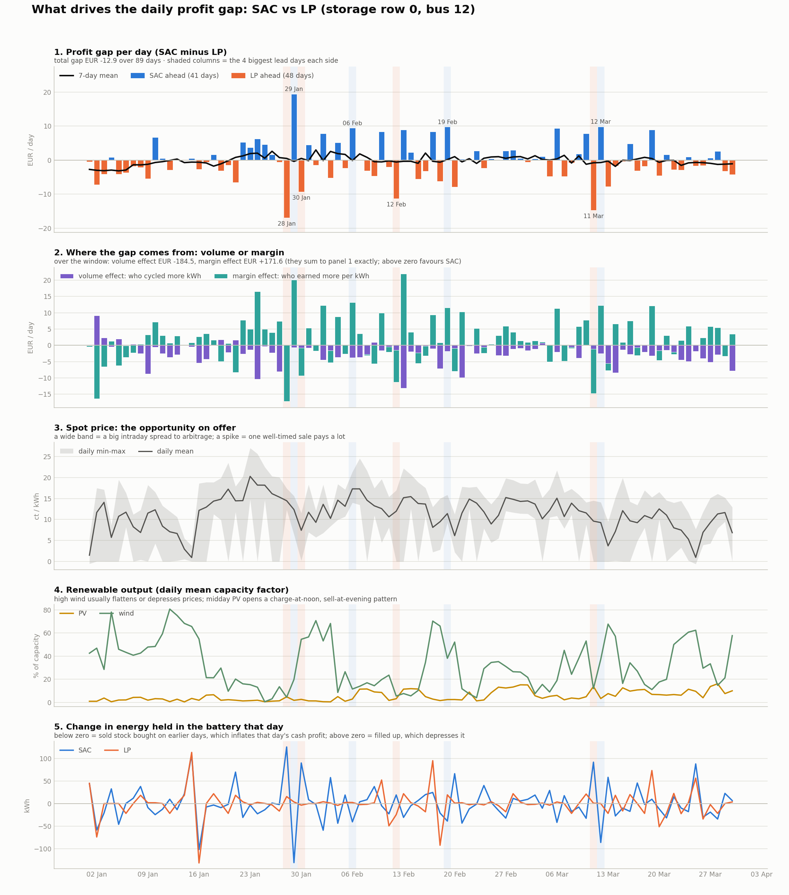

# Final Report: How the Code Works

**A learning battery (SAC), the surrogate it is trained in, and the arbitrage-only LP it is compared against**

*Project close-out and handoff report · October 2026*

---

## 0. The short version

The project asks one question: **can a battery that *learns* to trade energy do as well as one
that *calculates* the best plan?**

There are three parts to the answer, and this report explains each one:

1. **The SAC policy:** a small neural network that looks at the battery's charge and at
   recent and upcoming electricity prices every 15 minutes, and decides how much to charge or
   discharge. It is trained with Soft Actor-Critic (SAC), a reinforcement-learning method.
   Nobody tells it the rules of good trading; it learns them from rewards.
2. **The surrogate:** a fast, simplified copy of the market used only for training. The full
   simulation needs about 2 seconds per 15-minute step for its Gurobi market solve, so training
   there would take weeks. The surrogate drops the solver and runs about 300,000 steps in
   10–15 minutes. Crucially, it uses **the same code** for the battery physics, for what the
   agent sees and for how it is rewarded, so the network trained there can be dropped straight
   into the full simulation.
3. **The arbitrage-only LP:** the benchmark. A linear program that, every 15 minutes, computes
   the best charge/discharge plan for the next 6 hours, acts on the first step of that plan, and
   repeats. It is given the same price information, the same goal and the same way of placing
   orders as SAC, so the only difference between the two is *how* the decision is made.

Run over the same three months of 2023 in the full simulation, **SAC earned ≈98% of what the LP
earned** (€603 vs €612). The project's target was 75%. The two got there differently:

- **The LP moves more energy at a thinner profit** (1.76 ct per kWh sold); **SAC moves less
  energy at a fatter profit** (2.23 ct per kWh sold).
- **Once battery wear has any cost, SAC comes out ahead**: at 1 ct per kWh cycled, about €315 vs
  €246.
- **The LP has the safer worst day** (−€6 vs SAC's −€20).

An earlier headline, "SAC beats the optimiser 3×", was wrong: that optimiser had several bugs and
was solving a different problem. Section 8 tells that story.

> **"Surrogate policy" and "SAC policy" are the same thing.** There is one SAC network. It is
> *trained* in the surrogate and saved as `output/sac/surrogate_policy.pt` (hence the name), then
> *evaluated* by loading that same file into the battery agent in the full simulation. Section 4
> explains the hand-over.

---

## 1. The setting

### 1.1 The simulated market

The simulation (`mesa_model/model.py`) is a **Local Energy Community**: a rural low-voltage grid
from the SimBench benchmark (`1-LV-rural1--2-sw`) with households, farms, a heat pump, EVs, solar
and wind generators, an external grid connection and **five batteries**. Time moves in
15-minute steps. In every step:

1. Each agent submits a buy order (a *bid*) and/or a sell order (an *ask*): a quantity and a
   price.
2. The market optimiser (`optimization/market_optimizer.py`, Pyomo + Gurobi) clears all orders at
   once, respecting the grid's physical limits, and settles one uniform price for the step.
3. Each agent learns what actually traded and updates itself. The battery updates its charge
   level, and the SAC agent also computes its reward and learns.

Prices underneath are real German day-ahead spot prices (2021–2023). The external grid sells at
spot + 1.0 ct/kWh and buys at spot − 0.3 ct/kWh, so a battery has to buy and sell at least
1.3 ct/kWh apart before a round trip even breaks even.

### 1.2 The battery under study

Of the five batteries, **"row 0"** is the one under study. The other four are always run by the
existing household optimiser (`optimization/HN_optimizer.py`) and are background.

| | |
|---|---|
| Agent / bus | agent 23, grid bus 12 |
| Size / power | 146.7 kWh, ~73 kW (a full charge takes about 2 hours) |
| Efficiency | 95% each way (~90% round trip) |
| Self-discharge | 0.13% per day |
| Operating limits | charge kept between 5% and 95% |
| Grid fees | none: storage is exempt (§118 EnWG) |

What controls row 0 is chosen with the `STORAGE0_METHOD` environment variable:

| Value | Controller | Used for |
|---|---|---|
| `learning` (default) | the SAC policy | training in the live market, or frozen evaluation |
| `arbitrage` | the arbitrage-only LP | **the final benchmark** |
| `optimisation` | the household optimiser, like rows 1–4 | an earlier, unfair benchmark (see §6.4) |

---

## 2. The SAC policy

### 2.1 What it sees: the state (20 numbers)

Every 15 minutes the agent builds a list of 20 numbers describing the situation
(`state_features` in `mesa_model/storage_logic.py`). In plain terms:

| Group | Numbers | What they tell the agent |
|---|---|---|
| Battery | 3 | Charge level, and how much room is left before the upper and lower comfort limits |
| Price now vs. recent past | 5 | Is the current price high or low compared with the last 24 h? Compared with what this hour of day usually costs? Is it rising or falling over the last 1 h and 4 h? |
| Market conditions | 2 | How volatile prices are, and how big the trading costs (1.3 ct/kWh) are compared with that volatility |
| Calendar | 6 | Hour of day, day of week and month, each encoded as a point on a circle so that 23:00 sits next to 00:00 |
| **Upcoming prices** | 4 | From the next 6 h of known day-ahead prices: the average of the next hour, and the average, lowest and highest price over the next 6 h, each relative to the current price |

Three design choices matter:

- **Everything is relative.** Prices are expressed as differences from the recent average,
  divided by recent volatility, not as raw cents. A policy that learned "buy below 5 ct" in 2021
  would be useless in 2022's price crisis; "buy when the price is unusually low for this hour"
  still works.
- **Only legitimate information.** Past prices are prices the agent has actually observed.
  Future prices are *day-ahead* prices, which in the real market are published 12–36 hours in
  advance, so using the next 6 hours is not cheating.
- **No ratios.** The price series has thousands of zero and negative prices, where ratios blow
  up or flip sign, so all comparisons are differences.

### 2.2 What it does: the action and how it becomes an order

The network outputs **one number between −1 and +1**:

- **+1** = charge as fast as possible, **−1** = discharge as fast as possible, values in between
  are fractions of that.
- Anything between −0.05 and +0.05 is treated as **"hold"** and no order is placed. Without this
  deadband the agent would place a tiny order, and pay trading costs, in every single step.

`action_to_bid` (`mesa_model/agents.py`) turns that number into an actual order:

- **Charging:** a bid for the requested amount, priced high enough to be sure it clears against
  the external grid.
- **Discharging:** an ask for the requested amount, priced just below what the grid would pay.
  If that price would be below the market's floor (for example at negative prices), no ask is
  placed.
- **Safety overrides:** below 10% charge the battery is forced to charge, and above 95% it is
  forced to discharge, whatever the network says. These protect the hardware. The agent still
  learns from these steps, so it learns that drifting to the edges is costly.

> **Why the bid price looks oddly high.** The market optimiser adds about 15.7 ct/kWh of grid
> fees and levies to every purchase from the external grid in its objective. A bid that merely
> matched the grid's price lost to that fee term and never cleared, so the battery could never
> charge overnight. The bid therefore adds the fee on top, purely so that it clears. The battery
> never *pays* the fee: storage is fee-exempt at settlement, and the fee is zeroed for storage
> after clearing. It is a clearing device, not a cost.

### 2.3 What it is rewarded for: change in wealth

The obvious reward, "cash received minus cash spent", fails badly: every purchase looks like an
instant loss and every sale an instant gain. Earlier versions of this project (Monte Carlo and
TD agents) learned to sell off the battery's starting charge and then stop trading.

The reward used here is **the change in the battery's total wealth** over the step: cash plus
the value of the energy stored in it (`mark_to_market_reward` in `storage_logic.py`).

```
reward = cash from this step's trade
       + (value of stored energy after the step)  ×  γ
       − (value of stored energy before the step)
```

The stored energy is valued at what it could be **sold for right now**: after the 95% discharge
loss, and at the price the grid would actually pay. Buying 10 kWh therefore no longer looks like a
loss; it looks like swapping cash for energy worth slightly less, and it pays off only if the
energy is later sold at a higher price. Mathematically this is *potential-based reward shaping*.
Over a whole trajectory the inventory terms cancel out, so the best policy under this reward is
exactly the policy that makes the most real money. The shaping only makes learning easier; it
does not change the goal.

Two small extra terms:

- **A hard-limit penalty** (−0.5) if the charge goes below 5% or above 97%. This is always on.
- **A comfort-band nudge** towards 20–85% charge early in training. It fades linearly to zero
  over the first 100,000 steps, so it helps the agent out of early bad habits ("drain the battery
  and stay empty", or "fill it and never sell") without biasing the final policy.

### 2.4 How it learns: Soft Actor-Critic

SAC (`mesa_model/sac.py`) uses three kinds of small neural network, each with two hidden layers
of 64 neurons:

- **The actor** is the policy. Given the 20-number state, it outputs a bell curve over actions
  (a mean and a spread). During training it *samples* from that bell curve, which makes it
  explore. In evaluation it takes the mean, so the same situation always gives the same action.
- **Two critics** each estimate "how much total future reward can I expect if I take this
  action in this situation?" Using two critics and trusting the lower estimate stops the agent
  from chasing actions that only *look* good because of estimation error.
- **Target critics** are slowly-moving copies of the critics that keep the learning targets
  stable.

The learning loop:

1. Each experience (situation, action, reward, next situation) is stored in a **replay buffer**
   (200,000 entries in the surrogate). Old experience is reused many times, unlike the earlier
   Monte Carlo/TD agents, which threw each experience away after one use.
2. Random batches of 256 experiences train the critics to predict rewards better, and train the
   actor to pick actions the critics rate highly.
3. The "soft" in SAC: the actor is also rewarded for keeping its choices varied (high
   *entropy*). The weight on this (α) tunes itself during training, with a floor of 0.05 so that
   exploration never shuts off completely.

| Setting | Value | Plain meaning |
|---|---|---|
| Discount γ | 0.996 | A reward 1.8 days ahead counts half as much as one now, so overnight and next-day trades are visible |
| Learning rate | 3 × 10⁻⁴ | Step size for all three networks |
| Batch size | 256 | Experiences per learning update |
| Replay buffer | 200,000 (surrogate) / 100,000 (live) | How much past experience is kept |
| Warm-up | 2,000 steps (surrogate) / 500 (live) | Random actions before any learning starts |
| Reward scale | ×10 | Keeps the € rewards from being drowned out by the entropy term |
| Target update τ | 0.005 | How fast the target critics follow the critics |
| Seed | 42 | Makes training repeatable |

---

## 3. The surrogate: where the policy is trained

### 3.1 Why it exists

In the full simulation, every 15-minute step runs a Gurobi optimisation for the market, about
2 seconds each. One pass over three months is about 8,500 steps, or 4–5 hours. SAC needs
hundreds of thousands of steps to learn, which would mean weeks of computer time. The surrogate
(`mesa_model/storage_env.py`) removes the market solve and runs the same decisions about
**about 1,000× faster**.

### 3.2 What is identical to the full simulation, and what is simplified

| | Surrogate | Full simulation |
|---|---|---|
| Battery physics (charge update, power limits, efficiency, self-discharge) | `storage_logic.py` | **same code** |
| The 20 state numbers | `storage_logic.py` | **same code** |
| Reward | `storage_logic.py` | **same code** |
| Deadband, safety overrides, "no ask below the floor" rule | mirrored | `agents.py` |
| Order of events (decide → trade → observe next price → reward) | mirrored | `agents.py` |
| Battery parameters and price data | read from the full model at start-up | the same |
| **Does the order fill?** | Always, in full | Decided by the market optimiser |
| **Price paid / received** | spot + 1.0 / spot − 0.3 ct/kWh | the settled market price of that step |
| Other agents, grid limits | not modelled | modelled |

So the surrogate treats the battery as a **price-taker**: whatever it asks to buy or sell, it
gets, at the grid's prices. That is a reasonable approximation because the battery's bids are
priced to clear against the external grid anyway. But it *is* an approximation, which is why
every policy is checked in the full simulation before any result is reported.

Sharing one file (`storage_logic.py`) between the two environments, rather than writing the
logic twice, is the key design decision. Earlier in the project the two copies drifted apart
(for example, a self-discharge bug that made the battery lose 13% per day instead of 0.13%), and
policies that looked good in training failed in the market.

### 3.3 How training works (`train_surrogate.py`)

1. **Build the full model once, without running it.** This reads the real battery's parameters
   and the price data, so the surrogate uses exactly the same numbers. No Gurobi solve happens.
2. **Split the price history in three, by date:**

   | Split | Default period | Used for |
   |---|---|---|
   | Training | 1 Jan 2021 – 30 Sep 2022 | The agent practises and learns here |
   | Validation | 1 Oct – 31 Dec 2022 | Never trained on; used to pick the best policy |
   | Test | 1 Jan – 30 Mar 2023 (`config.yaml`) | The final evaluation in the full simulation |

   The periods can be changed with environment variables (see the README). They must not
   overlap, or the policy would be tested on prices it has already seen.
3. **Practise in one-day episodes.** Each episode starts on a random day in the training period
   with a random charge level (10–90%), so the agent sees many different situations. Before the
   episode starts, the agent's price memory is filled with the preceding 24 hours of prices,
   exactly as a live agent would have them.
4. **Learn after every step.** One SAC update per step, for 300,000 steps by default.
5. **Check on validation every 5,000 steps.** The current policy runs deterministically,
   without exploration or comfort-band nudges, through the whole validation quarter, and its
   profit is recorded. **The best-scoring policy is saved**, not the last one, because SAC's
   performance can get worse late in training.
6. **Output:** `output/sac/surrogate_policy.pt` (the best on validation) and
   `surrogate_policy_last.pt` (the final one). The file contains the actor, both critics, both
   target critics, the entropy weight and the step counters.

A quick check that needs no Gurobi, `analysis/eval_policy_on_2023_surrogate.py`, runs a saved
policy through the test quarter inside the surrogate. With the included policy it makes about
**+€412**. For reference, a simple "buy in the cheapest third of the last 24 h, sell in the
dearest third" rule makes €358, and perfect hindsight within each day makes €577.

---

## 4. From the surrogate to the full simulation

The trained network is loaded into the battery agent of the full simulation:

```bash
python analysis/run_comparison_eval.py --mode sac          # or: SAC_LOAD_POLICY=... SAC_EVAL=1 python main.py
```

This sets `SAC_LOAD_POLICY` (which file to load) and `SAC_EVAL=1` (evaluation mode). In
evaluation mode:

- the actor takes its **mean action**, with no random exploration, so runs are repeatable;
- **no learning happens**: nothing is stored in the replay buffer and no updates run. The
  policy that is evaluated is exactly the one that was trained.

The agent then works step by step exactly as in §2: it builds the state from prices it has seen
in the simulation, picks an action, places an order through `action_to_bid`, and, one step
later, reads back what actually traded and at what price, and updates its charge level.

What changes compared with the surrogate is that **the market decides the fills and the
price**. Orders may fill partially, and the settled price is the market's uniform price for
that step, not exactly spot ± margin. The full-simulation result is therefore the honest one;
the surrogate result is a sanity check.

Learning *inside* the full simulation is also possible (`STORAGE0_METHOD=learning` without
`SAC_EVAL`, and `SAC_EPOCHS=N python main.py` to repeat the quarter N times while keeping what
was learned). At about 5 hours per pass, it is only practical for fine-tuning, not for training
from scratch.

---

## 5. The arbitrage-only LP: the benchmark

### 5.1 Why a new benchmark was needed

The original benchmark was the household optimiser that already runs the other four batteries.
Comparing SAC with it gave a headline of "SAC earns 3× more", and that comparison turned out to
be unfair in several ways:

- That optimiser **charged the battery a phantom 16.7 ct/kWh fee** on every purchase (since
  fixed), so it hardly ever charged.
- It optimises the **whole household node's energy bill**, not the battery's trading profit,
  so it was solving a different problem.
- It saw **different information** and placed orders through a **different path**.

The arbitrage-only LP (`optimization/arbitrage_optimizer.py`) was built to remove every one of
those differences, so that the comparison measures only *learning vs. calculating*.

### 5.2 What is matched with SAC

| | SAC | Arbitrage LP |
|---|---|---|
| Battery | row 0, same physics code | **same** |
| Price information | current price + next 6 h of day-ahead prices | **same source** (see the caveat in §5.5) |
| Goal | trading cash + value of the energy left in the battery | **same** |
| How orders are placed | `action_to_bid`: deadband, safety overrides, fee-crossing bid, ask floor | **same function** |
| How the action is chosen | learned neural network | exact optimisation every step |

### 5.3 How it decides: plan 6 hours, act on 15 minutes, repeat

Every 15 minutes:

1. **Collect prices:** the current price plus the next 24 known day-ahead prices (6 hours), 25
   in all.
2. **Plan:** solve a linear program for the best buy and sell amounts in each of the 25 steps
   (details below).
3. **Act on the first step only**, then throw the rest of the plan away. Next step, plan again
   with updated information. This is called a *receding horizon*: the LP always looks 6 hours
   ahead, and that window slides forward.
4. **Turn the plan into SAC's language.** The planned first-step purchase (or sale) is divided
   by the most the battery could buy (or sell) this step, giving a number between −1 and +1:
   exactly the kind of action SAC outputs. That number goes through the same `action_to_bid`, so
   deadband, safety overrides and bid prices are identical.

Each solve takes a few milliseconds using SciPy's HiGHS solver, so the LP doesn't need a Gurobi
licence and doesn't compete with the market optimiser for one.

### 5.4 The optimisation problem

**Decisions:** for each of the 25 steps *t*, how much energy to buy, *b_t*, and to sell, *s_t*
(kWh, measured at the grid side).

**Objective: maximise money earned plus the value of what is left in the battery at the end:**

```
maximise   Σ_t [ s_t · (p_t − 0.3)  −  b_t · (p_t + 1.0) ] / 100      (trading cash, €)
         + κ · soc_end                                                (leftover energy, €)
```

Here *p_t* is the price in ct/kWh, 1.0 and 0.3 are the buy and sell margins, and
κ = capacity × 0.95 × (last price in the window − 0.3) / 100 is what a full battery could be sold
for at the end of the window. Without the last term, the LP would empty the battery at the end of
every 6-hour window, because it would see no value in energy it cannot sell within the window.
This is the same "value of stored energy" idea as SAC's reward (§2.3).

**Subject to:**

- **Charge level follows the physics** (same formula as `storage_logic.soc_transition`):
  `soc_t = soc_(t-1) × self-discharge + (b_t × 0.95 − s_t / 0.95) / capacity`
- **Charge limits:** 5% ≤ soc_t ≤ 95% in every step.
- **Power limits:** in a 15-minute step, at most rated power × ¼ h of energy can go in or out
  (adjusted for efficiency).
- **No sales at the floor:** in steps where the sell price would fall below the market's ask
  floor (negative prices), selling is not allowed. This mirrors the same rule in
  `action_to_bid` and the surrogate. It also stops a loophole: at strongly negative prices the
  LP could otherwise buy and sell at the same time to "burn" energy in the efficiency losses and
  call it profit.

Because the charge level is a linear function of the decisions, the whole problem is a **linear
program**: it has one guaranteed best answer and is solved exactly, with no learning and no
randomness. If a solve ever fails, the battery simply holds for that step, and the safety
overrides still apply.

### 5.5 What the LP has that SAC doesn't, and vice versa

The comparison is as fair as it can be made, but not perfectly symmetric:

- **The LP sees the next 6 hours in full detail.** It plans with all 24 individual future
  prices. SAC sees the same 6 hours compressed into four summary numbers (next-hour average,
  6-hour average, minimum and maximum). This gives the LP a small information edge.
- **The LP assumes its plan will be carried out at spot ± margin.** In the full simulation both
  sides face the same market, so neither knows its true fill or settled price in advance.
- **SAC can look further than 6 hours,** in a fuzzy way. Its discount factor makes rewards up to
  about two days ahead matter, and it has learned typical daily price patterns from two years of
  data. The LP is blind beyond 6 hours except through the end-of-window valuation.
- **The LP is exact within its view; SAC is an approximation.** The network can make mistakes
  in situations it rarely saw in training.

---

## 6. How the comparison is run and checked

### 6.1 Running it

Each side is one full-simulation run over 1 Jan – 30 Mar 2023 (8,544 steps, about 4 hours
each):

```bash
python analysis/run_comparison_eval.py --mode sac
python analysis/run_comparison_eval.py --mode arbitrage
python analysis/compare_sac_vs_optimisation.py --baseline arbitrage
```

Each run writes `output/comparison/eval_<mode>.jsonl`, with one line per battery per day
(profit, energy bought and sold, orders filled, charge levels) and a summary per battery.

### 6.2 Profit is counted the same way for both

For both runs, profit is the energy that actually traded in the market, valued at the price it
actually settled at. It is not the amount ordered or planned. This is the same accounting the SAC
agent uses for its own reward.

### 6.3 Built-in checks

- **Same code version.** Every log records the git commit and whether there were uncommitted
  changes. The comparison script **refuses to compare** runs from different commits or with
  uncommitted changes. An earlier comparison went wrong because the two runs came from code a
  week apart.
- **Leftover charge is credited.** Both runs start with the same charge, but they can end with
  different amounts. The energy left at the end is valued at what it could be sold for, and added
  to each side's profit ("adjusted profit"), so neither is penalised for keeping charge.
- **The background batteries act as a control.** Rows 1–4 are run by the same household
  optimiser in both runs, so their profits should nearly match. A large difference would mean the
  two runs' markets diverged too far for row 0 to be compared fairly. In practice they differed
  by about 1.5%, which sets the measurement noise on the comparison.

### 6.4 Why the household optimiser (`--mode optimisation`) is not the benchmark

It is still available, but it optimises the whole node's bill rather than the battery's trading,
uses different information, and takes 10–19 hours per run. The 3× result it produced is
superseded. It is kept so the history is reproducible.

---

## 7. Results


*Left: daily profit (7-day average). Middle: daily battery charge level. Right: orders filled
per day.*

### 7.1 Headline table

| | SAC (frozen policy) | Arbitrage LP |
|---|---:|---:|
| Profit over 89 days | €598.37 | €611.29 |
| Value of charge left at the end | €4.88 | €0.91 |
| **Adjusted profit** | **€603.25** | **€612.20** |
| **SAC as % of LP** | **98.5% (quote ≈98%)**, target >75% | |
| Energy bought / sold | 29,790 / 26,876 kWh | 38,370 / 34,667 kWh |
| **Profit per kWh sold** | **2.23 ct** | 1.76 ct |
| Full cycles per day (avg) | 2.2 | 2.8 |
| Orders filled per day | ~80 | ~47 |
| Average energy per order | ~8 kWh | ~18 kWh (≈ full power) |
| Average charge level | 57% | 45% |
| Charge level at the end | 40% | 7% |

### 7.2 Day-by-day picture

| | SAC | Arbitrage LP |
|---|---:|---:|
| Average day | €6.72 | €6.87 |
| Median day | €5.63 | €5.31 |
| Losing days | 17 of 89 | 16 of 89 |
| Worst day | **−€20.28** | **−€6.11** |
| Best day | €31.51 | €29.18 |
| January / February / March | €196 / €188 / €215 | €213 / €174 / €225 |
| Days where SAC beat the LP | 41 of 89 | |

The two are very close on almost every measure. SAC has the better median day. The LP has a
much better worst day, which is where its perfect 6-hour foresight shows most (see §7.5).



*Which side led on which days, split into "moved more energy" and "earned more per kWh", set
against the day's price spread, solar and wind output, and change in stored energy.*

### 7.3 How much to trust the 98%

The two runs are two separate simulations of a shared market. When the battery behaves
differently, local clearing prices shift a little for everyone. The other four batteries run the
same optimiser in both simulations and should earn the same amount each time; they differed by
up to €8.7. That puts roughly a **±1.5% error bar** on the ratio. The honest statement is
"≈98%", and the 1.5% gap is within the noise.

### 7.4 What changes when battery wear has a price

The simulation treats battery cycling as free: the battery is just as good on day 89 as on
day 1. Real lithium-ion batteries wear out, usually costed at roughly **1–5 ct per kWh
cycled**. Subtracting a wear cost afterwards:

| Wear cost | SAC | Arbitrage LP | Leader |
|---:|---:|---:|---|
| 0 ct/kWh | €598 | €611 | LP (+2%, within noise) |
| 0.5 ct/kWh | €457 | €429 | **SAC** |
| 1.0 ct/kWh | €315 | €246 | **SAC (+28%)** |
| 1.5 ct/kWh | €173 | €64 | **SAC (2.7×)** |
| 2.0 ct/kWh | €32 | −€119 | **SAC** |
| Break-even point | **2.1 ct/kWh** | **1.7 ct/kWh** | |

Two things follow, and they pull in different directions:

1. **As soon as wear costs anything, SAC is the better controller**, because it gets more money
   out of each kWh it cycles.
2. **Neither controller is comfortably profitable at realistic wear costs.** Both break even
   around 2 ct/kWh, the low end of what real batteries cost. The case for this particular
   battery doing pure arbitrage on this price series is thin whoever controls it.

A fairness caveat: neither side *knew* about wear while trading; it was subtracted afterwards.
An LP told about wear would trade less and do better than this table shows. The properly fair
version puts wear into both the LP's objective and SAC's reward (see §10).

### 7.5 Why the results came out this way

**Why the LP moves more energy for less profit per kWh**

- **LPs give all-or-nothing answers.** A linear program's best solution almost always sits at a
  corner: charge at full power or not at all. Its orders average ~18 kWh, the battery's maximum
  per step. Whenever the next 6 hours show *any* spread bigger than the round-trip loss, it
  takes that spread at full size.
- **Six hours is its whole world.** Beyond the window, nothing counts except "leftover charge is
  worth its sell price". So the LP happily completes a small round trip inside the window, even
  when holding the energy for a better price tomorrow evening would pay more. It can't see
  tomorrow evening.
- **It runs its inventory down.** Because leftover charge is valued cautiously, the LP tends to
  sell what it can't find a use for. That is why its average charge is lower (45%) and it ended
  the quarter almost empty (7%).

**Why SAC earns more per kWh**

- **SAC plans further ahead than the LP can see.** Its discount setting gives it a planning
  horizon of about 1.8 days, and it trained on almost two years of prices, so it learned the
  daily and weekly shape of prices. It can "know" that tonight's cheap hours are usually followed
  by an expensive evening tomorrow, even though that is outside its 6-hour price window. So it
  skips thin trades and holds charge for bigger spreads.
- **It adjusts the size of each trade.** SAC outputs a continuous action, so it places many
  medium-sized orders (~8 kWh average, ~80 fills a day) and adjusts gradually instead of
  flipping between full power and nothing.
- **It keeps charge in hand.** An average charge of 57% means it is usually ready to sell into a
  price spike.

**Why the LP has much better bad days**

The LP's worst day was −€6; SAC's was −€20. Inside its 6-hour window the LP has **perfect**
knowledge of prices and always picks the best plan for it, so it rarely makes a big mistake.
SAC's longer-range "knowledge" is a learned pattern, and patterns sometimes fail. When prices
don't follow the usual shape, SAC can end up holding energy it bought expecting a peak that
never came. That is the price of looking further ahead with a learned rule instead of a certain
one.

**Why they end up tied on total profit**

The two effects roughly cancel. The LP makes up in volume what it gives up in margin, and SAC
makes up in margin what it gives up in volume. That the totals land within 2% of each other is
partly a coincidence of this price series and battery. What is not a coincidence is that a
learned policy reached the level of an exact short-horizon optimiser.

### 7.6 Which one performed better?

**It depends on what you count, and each view has an honest answer:**

| Measure | Winner |
|---|---|
| Total profit, wear ignored | **Tie** (LP ahead by 1.5%, inside the noise) |
| Profit per kWh cycled | **SAC** (+26%) |
| Profit with any realistic wear cost | **SAC** |
| Median day | **SAC** (slightly) |
| Worst-case day / risk | **LP** (clearly) |
| Guarantees and explainability | **LP** (it can prove its plan is optimal and show why) |
| Speed per decision | Both fast: SAC is one network pass, the arbitrage LP solves in milliseconds |
| Cost to build | The LP needs an exact model of the market written by hand. SAC needs a training environment and careful debugging of the economics, but then adapts by retraining. |

**Overall verdict:** with equal information and equal rules, **a learned policy matched an
exact short-horizon optimiser to within the noise of the market**, and made better use of each
kWh of battery life. The optimiser is the safer choice when worst-case behaviour and guarantees
matter. SAC is the better choice when battery wear matters and when it can use patterns beyond
a fixed planning window.

---

## 8. How the project got here

Most of the effort went into making both sides *correct* and the contest *fair*, not into the
final comparison itself. Each stage fixed something the previous one exposed.

**Stage 1: Three generations of learning algorithm (spring 2026).** Each algorithm lives on its
own git branch.

| | Monte Carlo | TD Actor-Critic | **SAC (final)** |
|---|---|---|---|
| Reward | raw cash per step | cash + hand-tuned bonuses/penalties | change in total wealth (cash + value of stored energy) |
| Memory | 12 h of experience, then thrown away | 48 steps, then thrown away | replay buffer, reused |
| Planning horizon | short | ~12 h | ~1.8 days |
| Network size | ~8 neurons | ~8 neurons | 64×64, with twin critics |

Rewarding raw cash each step teaches a battery to empty itself, because selling pays now while
buying only pays later. The fix was the mark-to-market reward (§2.3).

**Stage 2: SAC was starved of experience (June).** The first live SAC run lost €83 over 88 days.
It *was* learning (profit per day rose steadily and reached break-even just as the data ran
out), but one pass over the quarter gives only 8,500 samples and SAC needs 100,000 to 1,000,000.
The fix was the surrogate (§3).

**Stage 3: Economics bugs that made failure the *rational* choice (July).** A trained policy
still lost money live, because the simulated economics were wrong:

1. **Self-discharge was 100× too high** (13%/day instead of 0.13%/day). A 12-hour overnight hold
   lost 6.7% of the charge, so the agent correctly refused to hold energy overnight.
2. **The battery's buy orders could never fill at night.** Its bid exactly *tied* the grid's
   price, and the market's fee accounting then preferred not to trade (§2.2).
3. **Reward, surrogate and settlement disagreed about fees.** The reward said round trips were
   nearly free; the market charged 7.85–15.7 ct/kWh on every purchase. The agent churned
   ~1.7 cycles a day for a 0.28 ct spread and lost €2.76/day.

Storage was made fee-exempt (matching German law) consistently in reward, surrogate and
settlement; bids were made to cross the fee threshold; the state was extended to 20 numbers
with the next 6 hours of prices; and the hold deadband was added. The frozen policy then made
+€412 in the surrogate and **+€610 over 88 days** in the live market, with 72 of 88 days
profitable.

**Stage 4: A misleading 3× win (9 August).** Against the household optimiser on the same
quarter, SAC made €634 and the optimiser €201: "306.5%". But the optimiser bought on only 7% of
steps (SAC: 46%), and both earned **the same margin per kWh (2.24 vs 2.22 ct)**. SAC wasn't
trading better, it was trading more against an opponent that had mostly stopped. About a quarter
of SAC's apparent edge was also taken from the other batteries, because its extra trading moved
prices against them.

**Stage 5: Why the optimiser wouldn't charge (10–16 August).** Five bugs in the household
optimiser, each confirmed by instrumenting live runs:

1. **A phantom charging fee:** every kWh of charging was priced at spot + 16.7 ct in fees the
   market never charges batteries. With daily spreads of only 5–8 ct, almost every trade looked
   like a loss.
2. **Its fallback bid couldn't clear** (the same tie problem SAC had).
3. **Its charge range was clamped to 20–80%** instead of 5–95%.
4. **Leftover energy was valued ~100× too high** (a units error).
5. **An ask price that could never clear.**

The fee terms had to be split carefully so that battery charging became exempt while household
consumption still paid fees.

**Stage 6: Making the optimiser trustworthy (16–21 August).** With charging unblocked, the
optimiser traded a lot but at thin margins (~1.1–1.2 ct/kWh). Its solver formulation was rewritten
(an all-or-nothing switch replaced by an equivalent smooth form), cutting a step's solve time
from **1,136 s to 2 s** with every solve certified optimal. That bought certainty and speed, not
money (+€0.37 over five days). The comparison was still unfair for a reason no bug fix could
solve: **the two weren't playing the same game** (§5.1). The code-version stamping and the
refusal to compare mismatched runs (§6.3) were added at this point, after one comparison was
caught mixing a stale run with a new one.

**Stage 7: The level-field rematch (22–23 August).** The arbitrage-only LP (§5) was built, both
sides were run over the full 89 days on the same commit, and the result is §7.

The lesson for the dissertation: **the benchmark has to be checked as carefully as the method
being tested.**

---

## 9. What was achieved

1. **A working RL battery trader.** It went from losing money (−€83, then −€2.76/day) to earning
   ~€600 per quarter in a live simulated market, on data it had never seen.
2. **A fast training environment** that cut training from weeks to minutes by sharing exact
   battery, state and reward code with the live agent.
3. **Nine real bugs found and fixed**, each of which quietly decided the outcome: a 100×
   self-discharge error, bids that couldn't fill, reward/settlement fee mismatches, a phantom
   16.7 ct charging fee in the optimiser, a 100× overvalued stored-energy credit, a wrong charge
   band, and two more order-pricing errors.
4. **A certified optimiser:** solves went from 1,136 s with no quality guarantee to 2 s with
   every solve proven optimal.
5. **A fair benchmark:** the arbitrage-only LP matches SAC's information, goal and order path,
   and its battery physics were checked against the shared code to within 1e-15.
6. **Reproducible comparisons:** every run records the exact code version; the comparison
   refuses mismatched or uncommitted runs and checks the background batteries, not just totals.
7. **An answer to the research question:** ≈98% of the optimum, against a 75% target.

---

## 10. Limitations and future work

### 10.1 What could still be improved

| Issue | How |
|---|---|
| **No battery-wear cost anywhere** (the most important open item) | Add a per-kWh-cycled cost to SAC's reward *and* the LP's objective, retrain SAC and rerun both. This turns "who wins" into "does this battery make money at all", and will probably widen SAC's lead. |
| SAC's bad days (−€20 worst) | Give SAC more forward information. Day-ahead prices are published around noon for the whole next day, so 12–36 hours are legitimately knowable, not just 6. Train on more varied years, or add risk-sensitive training. |
| SAC sees the forecast compressed | Give SAC all 24 future prices (or more), not four summary numbers, to remove the LP's information edge (§5.5). |
| The LP's short-sightedness | Lengthen the LP's window to the real day-ahead horizon. This raises the benchmark too, so do it together with the SAC change above. |
| The surrogate always fills | Model partial fills and settlement-price uncertainty in the surrogate. |
| One policy, one quarter, one seed | Train 3–5 policies with different seeds and test on several quarters (data covers 2021–2023). Training is cheap; only the live evaluation is slow (~4 h per run). Summer, with more solar and negative prices, would be the most informative addition. |
| Hyperparameters not tuned; rare events under-learned | The discount factor, reward scale and network size have never been swept. Prioritised replay (learning more from rare price spikes and negative prices, where the money is) was never built. |

### 10.2 What can't be removed, and why

| Issue | Why |
|---|---|
| **The ±1.5% noise band** | Each controller has to run in its own simulation, and the battery's own trading moves local prices. Both controllers can't run in the *same* market at the same time. A price-taker test would remove the noise but would no longer be the live market. The best that can be done is to measure the noise, which was done (§7.3). |
| **Perfect "day-ahead" prices** | In this data set, the day-ahead prices both sides see are exactly the prices that happen. That flatters the LP most, because it trusts them fully. Real forecasts have errors, so SAC's real-world standing may be *better* than here, but that was not tested. |
| **No optimality guarantee for SAC** | An LP can prove its plan is the best within its window; a neural network can't. SAC's performance is measured, not guaranteed, and it can fail in conditions it never saw. This is inherent to reinforcement learning. |
| **Thin margins on this price series** | Q1 2023 daily spreads are ~5–8 ct/kWh. A round trip loses ~10% to efficiency plus 1.3 ct in grid margins, leaving about 2 ct/kWh of profit. No controller can create spread that isn't there. If storage had to pay grid fees (7.85–15.7 ct/kWh), pure arbitrage would be unprofitable for *any* controller, which is why the §118 exemption exists. |

### 10.3 Future experiments

1. **Battery wear in both objectives** (see above).
2. **Realistic, imperfect forecasts.** Give the LP noisy price forecasts instead of perfect ones.
   This is where reinforcement learning is expected to have a real advantage, since it learns to
   act under uncertainty while an LP trusts its inputs completely.
3. **A longer look-ahead for both** (12–36 h), to see whether SAC's bad days shrink.
4. **Battery plus household.** Let SAC run the battery while the optimiser runs the household
   devices on its bus, and compare total household cost with optimisation alone. Expect pure
   optimisation to win, since SAC never sees the household load. A fair version needs a
   household-aware SAC, with load in its state and household cost as its reward.
5. **Fee scenarios.** Rerun at 0, 7.85 and 15.7 ct/kWh with a fee-aware reward. Pure arbitrage
   probably fails at full fees for everyone; the question is which controller fails least, and
   whether SAC learns to store local solar instead.
6. **A hybrid controller:** the optimiser as planner and safety net, with the learned policy
   correcting for what the forecast gets wrong. This would combine the LP's good worst case with
   SAC's better margins.

---

## Appendix A: Plain-English glossary

| Term | Meaning |
|---|---|
| **Arbitrage** | Buy energy when cheap, store it, sell when expensive. |
| **SOC** | State of charge: how full the battery is (0–100%). |
| **SAC** | Soft Actor-Critic: a reinforcement-learning method that learns a continuous action (how hard to charge or discharge) by trial and error. |
| **Policy** | The trained SAC network: the rule that maps a situation to an action. Saved as a `.pt` file. |
| **Surrogate** | The fast, simplified copy of the market used only for training. |
| **LP** | Linear program: a mathematical optimisation that finds the provably best plan for a problem written as linear equations. |
| **Receding horizon** | Plan 6 hours ahead, carry out only the next 15 minutes, then re-plan. |
| **Mark-to-market reward** | Reward = change in cash plus the value of the energy in the battery, rather than cash alone. |
| **Margin (ct/kWh)** | Profit divided by energy sold: how much each unit of trading earns. |
| **Cycle** | One full charge and discharge of the battery's capacity. |
| **Wear / degradation** | Loss of battery life from cycling, expressed as a cost per kWh cycled. |
| **Terminal SOC adjustment** | Adding the sale value of whatever charge is left at the end, so a battery that finishes full isn't penalised compared with one that sold everything. |
| **§118 EnWG** | German rule exempting grid-scale storage from grid fees on charging. |

## Appendix B: Where each piece lives

| Piece | File |
|---|---|
| State, reward, battery physics (shared) | `mesa_model/storage_logic.py` |
| SAC algorithm (networks, replay buffer, updates) | `mesa_model/sac.py` |
| SAC battery agent (state building, `action_to_bid`, reward, logging) | `mesa_model/agents.py`, class `storage` |
| Surrogate environment | `mesa_model/storage_env.py` |
| Surrogate training | `train_surrogate.py` → `output/sac/surrogate_policy.pt` |
| Quick policy check (no Gurobi) | `analysis/eval_policy_on_2023_surrogate.py` |
| Arbitrage-only LP | `optimization/arbitrage_optimizer.py` (called from `agents.py` when `STORAGE0_METHOD=arbitrage`) |
| Choosing row 0's controller | `mesa_model/model.py` (`STORAGE0_METHOD`) |
| Full-simulation evaluation runs | `analysis/run_comparison_eval.py` |
| Comparison and checks | `analysis/compare_sac_vs_optimisation.py` |
| Market clearing | `optimization/market_optimizer.py` |
| Charts | `comparision_graphs/` |
| Setup and step-by-step commands | `readme.md` |

The evaluation logs behind §7 (`eval_sac.jsonl` and `eval_arbitrage.jsonl`, from commit
`f83c38c`) are not included in the repository; rerunning Steps 3–4 in the README regenerates
equivalent logs.
