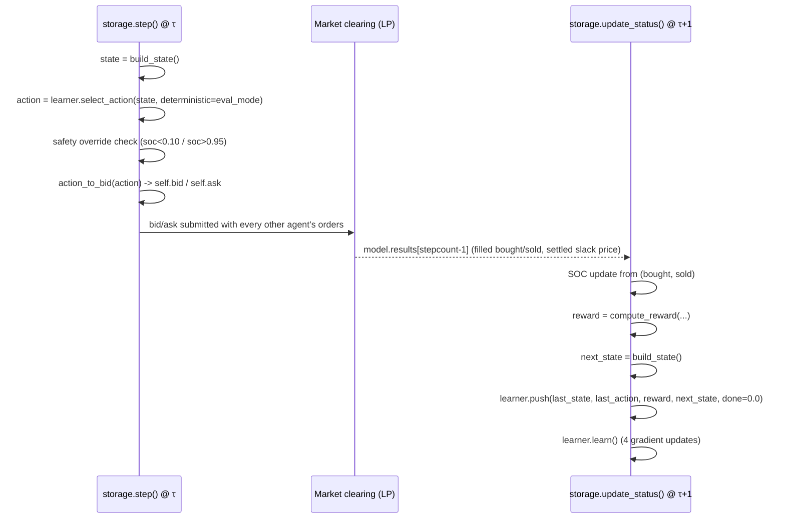
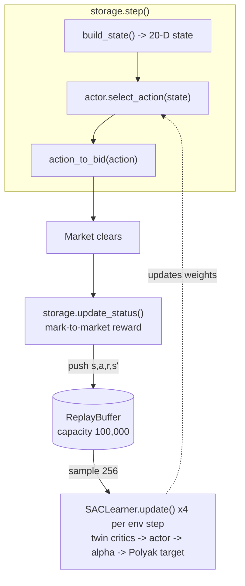

# Storage Agent — Soft Actor-Critic (SAC)

> **Branch:** `algo/soft-actor-critic`. Each `algo/*` branch implements a
> different RL algorithm for the `storage` agent (`mesa_model/agents.py`)
> while the rest of the Local Energy Community (LEC) simulation is
> unchanged. This branch implements **Soft Actor-Critic** in PyTorch:
> `mesa_model/sac.py` (algorithm), `mesa_model/storage_logic.py` (state /
> reward / physics, shared with the fast surrogate), `mesa_model/storage_env.py`
> (surrogate env), `train_surrogate.py` (offline trainer).

This is a single technical reference, not a tutorial: every state feature,
every reward term, every hyperparameter, and every script in this branch,
each tied to the exact line(s) that implement it.

## Contents

- [System context](#system-context)
- [Quickstart](#quickstart)
- [File map](#file-map)
- [Storage agent lifecycle](#storage-agent-lifecycle)
- [Market interface: `provide_a_power` / `action_to_bid`](#market-interface-provide_a_power--action_to_bid)
- [State vector (20-D)](#state-vector-20-d)
- [Reward: mark-to-market wealth change](#reward-mark-to-market-wealth-change)
- [SAC algorithm](#sac-algorithm)
- [Surrogate training environment](#surrogate-training-environment)
- [Training & evaluation workflows](#training--evaluation-workflows)
- [Analysis / benchmarking scripts](#analysis--benchmarking-scripts)
- [Output artifacts](#output-artifacts)
- [Current results](#current-results)
- [Design history](#design-history)
- [Known gaps](#known-gaps)

---

## System context

The wider project is an agent-based simulation of a **Local Energy
Community (LEC)**: a SimBench low-voltage grid (`1-LV-rural1--2-sw`)
populated with households, farms, industry, heat pumps, EVs, RES generators,
and a battery `storage` agent, cleared every 15-minute step by a Pyomo/Gurobi
LP (`optimization/market_optimizer.py`, `optimization/HN_optimizer.py`).
This branch only changes how the `storage` agent decides what to bid; every
other agent type and the clearing mechanism itself are untouched.

**Objective:** the `storage` agent maximises profit through energy
arbitrage — buy when cheap, discharge when expensive — subject to real
round-trip efficiency losses, self-discharge, and (for every *other* market
participant) grid fees. **Success criterion:** SAC profit should reach
>75% of the `optimisation` method's profit (a near-deterministic
`HN_optimizer` upper bound) on the same held-out window — see
[Known gaps](#known-gaps) for the current state of that specific
comparison.

Exactly one of the SimBench grid's storage rows (row 0, at its native bus)
runs `method="learning"` (SAC); every other storage unit in the grid runs
`method="optimisation"` (`mesa_model/model.py:194-202`). Both methods are
implemented in the same `storage` class (`mesa_model/agents.py:407`); this
document only covers the `"learning"` path.

---

## Quickstart

```bash
conda activate Diss_clean
pip install torch --index-url https://download.pytorch.org/whl/cpu   # one-time: SAC dependency

# 1. Fast path: train the policy on the no-Gurobi surrogate (~10-15 min for 300k steps)
SAC_SURROGATE_STEPS=300000 python train_surrogate.py

# 2. Honest evaluation: load the frozen policy into the real Mesa/Gurobi market
#    over config.yaml's window (default 01.01.2023-30.03.2023, held out from training)
SAC_LOAD_POLICY=output/sac/surrogate_policy.pt SAC_EVAL=1 python main.py

# 3. Inspect the eval run
python analysis/analyze_eval_run.py            # profit/SOC/spread breakdown + plot
python analysis/naive_baseline_q1_2023.py       # causal-floor / perfect-foresight-ceiling reference

# Alternative: train directly on the live market (slow — ~2.25 s/Gurobi-step)
SAC_EPOCHS=1 python main.py
```

> **Dependency note:** this branch requires **PyTorch** (CPU build is
> sufficient), which the MC/TD branches don't. `mesa_model/sac.py` sets
> `KMP_DUPLICATE_LIB_OK=TRUE` and pins PyTorch to 1 thread so its bundled
> OpenMP runtime coexists with Gurobi/MKL on Windows, and so the tiny
> networks don't oversubscribe CPU against the market solve.

---

## File map

| File | Role |
|---|---|
| `mesa_model/sac.py` | `ReplayBuffer`, `Critic`, `GaussianActor`, `SACLearner` — the algorithm, with no simulation-specific code |
| `mesa_model/storage_logic.py` | Single source of truth for `state_features`, `mark_to_market_reward`, `provide_power_kwh`/`soc_transition` — imported by both the live agent and the surrogate, so they see byte-identical state/reward/physics |
| `mesa_model/storage_env.py` | `StorageArbitrageEnv` — the fast, no-Gurobi surrogate market |
| `mesa_model/agents.py` | `storage` class (`method="learning"` path: `_setup_learning`, `provide_a_power`, `build_state`, `action_to_bid`, `compute_reward`, `step`, `update_status`, episode logging) |
| `mesa_model/model.py` | `LEM` Mesa model: creates every agent (incl. the learning battery at `grid.storage.loc[0]`), runs the LP clearing each step, holds `sref`/`gridfee_ext`/`levies_ext`/margins used by the storage agent |
| `optimization/market_optimizer.py` | LP clearing; zeroes the fee columns for `Agent Type == "storage"` (`§118 EnWG` exemption) and folds the external-buy fee into the welfare objective as `gridfee_levies_ext` |
| `train_surrogate.py` | Offline SAC trainer on the surrogate: train/val split, best-on-validation checkpointing |
| `main.py` | Live-market driver: single or multi-epoch (`SAC_EPOCHS`) pass over `config.yaml`'s window; writes `data_results_N.csv` / `HN_results_N.csv` via `data/csv_writer.py` |
| `analysis/analyze_eval_run.py` | Isolates a frozen-policy (`SAC_EVAL=1`) run from `episode_logs.jsonl` and plots profit/SOC/spread |
| `analysis/eval_policy_on_2023_surrogate.py` | Runs a saved policy deterministically inside the surrogate over the held-out window — isolates policy quality from live-market fill effects |
| `analysis/naive_baseline_q1_2023.py` | Causal-threshold floor + perfect-foresight ceiling reference points, computed with the same battery physics |
| `output/sac/episode_logs.jsonl` | Per-episode (per simulated day) JSONL log, appended by `_log_episode` |
| `data/config/config.yaml` | `main:` block has `sref`, `timestep`, `gridfee_ext`/`levies_ext`, solver, simulation window; `storage:` block (`SOC_start`, per-bus `bus-info`, `efficiency`) is legacy and **not** what parameterises the learning battery — see [Storage agent lifecycle](#storage-agent-lifecycle) |

---

## Storage agent lifecycle

### Construction

`storage(model, capacity, power, node, efficiency, discharge, method)`
(`mesa_model/agents.py:407-446`) is instantiated once per row of
`model.grid.storage` (`mesa_model/model.py:198-202`):

```python
method = "learning" if a == 0 else "optimisation"
storage(self,
        self.grid.storage.loc[a]["max_e_mwh"] * 1000,             # capacity, kWh
        self.grid.storage.loc[a]["p_mw"] * -1000,                 # max_power, kW
        self.grid.storage.loc[a]["bus"],                          # node
        self.grid.storage.loc[a]["efficiency_percent"],           # one-way efficiency (already a fraction, e.g. 0.95, despite the column name)
        1 - self.grid.storage.loc[a]["self-discharge_percent_per_day"] / 100,  # daily retention
        method)
```

Row 0 of the SimBench dataset's storage table is the SAC agent — a real
unit at its real bus (bus 12 for `1-LV-rural1--2-sw`), not a synthetic
duplicate. Its physical parameters as read from that row: **capacity ≈
147 kWh, max power ≈ 73 kW, one-way efficiency 0.95**. `discharge` is a
**daily** retention fraction; `__init__` converts it to a per-step value:

```python
timestep_frac = model.timestep.seconds / 86400.0     # 900s / 86400s = 0.010417 for a 15-min step
self.discharge = discharge ** timestep_frac           # per-step retention, e.g. 0.99998645
```

`config.yaml`'s `storage:` block (`SOC_start`, `bus-info`, `efficiency`)
does **not** feed these values for the learning agent — it's a legacy
per-bus-type table used elsewhere in the simulation. Only `soc =
config.storage["SOC_start"]` (0.40) is read at construction.

If `method == "learning"`, `__init__` calls `_setup_learning()`
(`agents.py:448-530`), which:

- Sets `state_dim = STATE_DIM` (20, from `storage_logic.py`).
- Sets `self.gamma = 0.996`, `self.reward_scale = 10.0`.
- Builds the `SACLearner` (see [hyperparameters](#hyperparameters)).
- Sets the soft operating band `soc_floor = 0.20`, `soc_ceiling = 0.85`,
  and the annealed-shaping schedule `soc_shaping_weight = 1.0`,
  `soc_shaping_anneal = 100_000` env steps.
- Optionally loads a pretrained policy from `SAC_LOAD_POLICY` and sets
  `self.eval_mode = (SAC_EVAL == "1")` — see
  [Training & evaluation workflows](#training--evaluation-workflows).
- Initialises the causal observed-price buffers: `price_history` (deque,
  maxlen 96 = 24 h), `_price_lag_1h` (maxlen 4), `_price_lag_4h` (maxlen
  16), `hourly_price_ewma` (dict keyed by hour-of-day, β = 0.05).
- Initialises transition-assembly state (`last_state`, `last_action`,
  `last_decision_price`, `last_soc`, `last_override_active`) and episode
  bookkeeping (`cumulative_reward`, `cumulative_profit`,
  `trade_count_buy/sell`, etc.).

### Per-step contract

Acting and learning are split across two Mesa ticks, because the reward
for a decision at step τ depends on the market's clearing result for τ,
which isn't known until τ+1:



`storage.step()` (`agents.py:846-915`, `method == "learning"` branch,
`agents.py:887-906`):

```python
state = self.build_state()
action = self.learner.select_action(state, deterministic=self.eval_mode)

override = False
if self.soc < 0.10:
    action = 1.0;  override = True
elif self.soc > 0.95:
    action = -1.0; override = True

self.last_state = state
self.last_action = action
self.last_decision_price = self.get_current_price()
self.last_soc = self.soc
self.last_override_active = override
self.action_to_bid(action)
```

`storage.update_status()` (`agents.py:667-768`) runs every tick (for
every storage agent, learning or not) to apply the settled trade to SOC;
the SAC-specific tail only runs `if self.method == "learning"`:

```python
old_soc = self.soc
energy_delta = bought * self.efficiency - sold / self.efficiency
self.soc = clip(old_soc * self.discharge + energy_delta / self.capacity, 0, 1)
```

then, for the learning agent: read the settled slack price, append it to
the causal buffers, update the hourly EWMA, compute the reward, push the
`(s, a, r, s', done=0.0)` transition (`done` is always 0 — this is a
continuing task, not episodic in the RL sense; the periodic "episode" log
is purely a day-length reporting window), and run `learner.learn()`
(`self.learner.learn()`, 4 gradient updates via `updates_per_step`).
**Overridden transitions are pushed to replay** — the actor is never
trained toward the forced action (it resamples its own action inside the
SAC losses), but the critic learns that hitting the SOC floor triggers a
costly forced recharge, which is exactly the signal needed to teach the
policy to avoid the floor voluntarily.

Every `update_frequency = 96` steps (1 simulated day), `_print_episode_summary()`
prints a block to stdout, `_log_episode()` appends a JSON record to
`output/sac/episode_logs.jsonl` (schema in
[Output artifacts](#output-artifacts)), and `_reset_episode_counters()`
zeroes the per-day accumulators (`cumulative_reward`/`profit`/`bought`/`sold`,
trade counters — **not** the SAC learner's replay buffer or step counters,
which persist for the whole run).

---

## Market interface: `provide_a_power` / `action_to_bid`

### Power limits

`provide_a_power()` (`agents.py:531-542`) returns
`[max_discharge, max_charge]` in **per-unit market space** (divided by
`model.sref = 100`), respecting both the SOC floor/ceiling (0.05/0.95
physical limits, not the soft 0.20/0.85 band) and the rated power:

```python
a_power_discharge = min((soc - 0.05) * capacity * 4, max_power) / sref * efficiency   # x4 = 1/(15min in hours)
a_power_charge    = min((0.95 - soc) * capacity * 4, max_power) / sref / efficiency
```

(`storage_logic.provide_power_kwh` is the kWh-space equivalent used by the
surrogate; `sref` cancels between bidding and settlement so the two are
numerically consistent — see the cross-check note in
`storage_logic.py:156-163`.)

### Bid/ask construction

`action_to_bid(action)` (`agents.py:597-642`), called right after
`select_action` in `step()`:

```python
fee_ext = model.gridfee_ext + model.levies_ext        # ≈ 11 + 4.7 = 15.7 ct/kWh

if soc < 0.10:                              # emergency charge (checked first, overrides deadband)
    bid_price = 1000.0                      # guaranteed fill
elif soc > 0.95:                            # emergency discharge
    ask_price = ASK_PRICE_FLOOR             # 0.01 ct/kWh — guaranteed fill
elif action > ACTION_DEADBAND:              # 0.05 — charge
    power = min(action * max_charge, max_charge)
    bid_price = price_now + margin_buy + fee_ext + 0.01
elif action < -ACTION_DEADBAND:             # discharge
    power = min(-action * max_discharge, max_discharge)
    ask_price = price_now - margin_sell - 0.01
    # order withheld entirely if ask_price < ASK_PRICE_FLOOR (0.01)
else:
    pass                                     # |action| <= 0.05: deliberate hold, no order
```

**Why the bid must cross `fee_ext`:** the LP's welfare objective adds a
term `gridfee_levies_ext = P_ext_buy · (gridfee_ext + levies_ext) / 4`
(`optimization/market_optimizer.py:273-275`) for *every* external grid
purchase. A bid that only clears `price + margin_buy` ties the grid's own
ask and loses to that fee term in the minimisation, so external buys
(the only way to charge overnight, when local RES/load can't supply)
structurally could not clear before this term was added — see
[Design history](#design-history). The storage agent itself never
actually pays this fee: `market_optimizer.py:630-631` zeroes the
`Fees and Levies LEC/External` columns for every `Agent Type == "storage"`
row after settlement (the §118 EnWG exemption modelled in this project).
Crossing `fee_ext` in the bid is purely a clearing device, not a real cost.

Each order is a `[min_power, max_power, price_fn, "lin"]` tuple consumed
by the LP (`offer_function(price)` returns a linear `power -> €`
function); `self.bid`/`self.ask` and their `coefficients_bid`/`coefficients_ask`
are reset to zero-power at the top of every call before being (possibly)
filled in.

Filled volumes are always read back from `model.results` in
`update_status()`, never the requested amount — the reward and SOC update
both use actually-traded energy.

---

## State vector (20-D)

Built by `storage_logic.state_features` (`mesa_model/storage_logic.py:35-100`),
called from `storage.build_state()` (`agents.py:584-595`). Features 0–15
use only the observed-price rolling buffers populated in
`update_status()`; features 16–19 use the next known day-ahead prices
(`get_future_prices`, `agents.py:556-564`, reading `model.market_price`
directly by timestamp position) — real day-ahead markets publish prices
12–36 h ahead, so this is public information, not future leakage. All
price-difference features are normalised by the 24 h rolling std, not
expressed as ratios: the price series has thousands of negative / near-zero
points where a ratio blows up or flips sign.

| Idx | Feature | Formula |
|---|---|---|
| 0 | `soc` | Battery charge level, `[0, 1]` |
| 1 | `headroom_ceiling` | `(soc_ceiling − soc) / (ceiling − floor)`, clipped `[-5,5]` |
| 2 | `headroom_floor` | `(soc − soc_floor) / (ceiling − floor)`, clipped `[-5,5]` |
| 3 | `price_norm` | `(price − mean₂₄ₕ) / std₂₄ₕ` |
| 4 | `percentile` | Fraction of the last 96 observed prices strictly below the current one |
| 5 | `price_vs_base` | `(price − hourly_EWMA[hour]) / std₂₄ₕ` — cheap/expensive *for this hour of day*; single most informative feature (lets the policy recognise a predictable evening peak by baseline, not just react to level) |
| 6 | `mom_1h` | `(price − price₁ₕ_ago) / std₂₄ₕ` (0 until the 1 h lag buffer is full) |
| 7 | `mom_4h` | `(price − price₄ₕ_ago) / std₂₄ₕ` (0 until the 4 h lag buffer is full) |
| 8 | `vol` | `std₂₄ₕ / |mean₂₄ₕ|`, clipped `[0, 5]` |
| 9 | `spread_norm` | `(margin_buy + margin_sell) / std₂₄ₕ`, clipped `[0, 5]` — round-trip transaction cost relative to capturable volatility |
| 10–11 | `sin_hour, cos_hour` | `sin/cos(2π·hour/24)` |
| 12–13 | `sin_dow, cos_dow` | `sin/cos(2π·weekday/7)` |
| 14–15 | `sin_month, cos_month` | `sin/cos(2π·(month−1)/12)` |
| 16 | `fwd_1h` | `(mean of next 4 known DA prices − price) / std₂₄ₕ` |
| 17 | `fwd_6h_mean` | `(mean of next 24 known DA prices − price) / std₂₄ₕ` |
| 18 | `fwd_6h_min` | `(min of next 24 known DA prices − price) / std₂₄ₕ` |
| 19 | `fwd_6h_max` | `(max of next 24 known DA prices − price) / std₂₄ₕ` |

`FORECAST_STEPS = 24` (6 h at 15-min steps). If fewer than 24 future
prices are available (e.g. near the end of the run), the missing entries
are padded with the current price, so the corresponding forward feature
degrades to 0 rather than raising an error. All price-difference features
are clipped to `[-5, 5]` (`_clip`, `storage_logic.py:31-32`).

Old 16-D policies (pre the forward-price features) are **binary
incompatible** with this state and cannot be loaded — the input layer
shape differs.

---

## Reward: mark-to-market wealth change

`storage_logic.mark_to_market_reward` (`storage_logic.py:113-152`), called
from `storage.compute_reward()` (`agents.py:644-665`).

**Why not raw cashflow:** `reward = (sold − bought)·price` punishes every
buy and rewards every sell regardless of timing, so the reward-maximising
shortcut is to sell off the battery's starting charge and stop trading —
a real failure mode of this project's earlier MC/TD agents (see
[Design history](#design-history)).

**The fix — potential-based inventory shaping** (Ng et al., 1999):

```python
cashflow    = (sold * p_sell - bought * p_buy) / 100          # €, at SETTLED prices
phi(p, soc) = soc * capacity * efficiency * max(p - margin_sell, 0) / 100   # € liquidation value
reward      = cashflow + gamma * phi(p_now, soc_new) - phi(p_decision, soc_old)
```

- `p_buy` / `p_sell` — the uniform **settled slack price** read from
  `model.results` in the live market (`p_settle`,
  `agents.py:690-697`), falling back to `p_decision ± margin` if the
  slack price is unavailable that step (matches the surrogate's model
  exactly, `agents.py:732-735`).
- `phi` is a **liquidation value**: what the stored energy would realise
  if sold *right now*, at the sell-side price, after round-trip
  efficiency — not the mid price, which was found to over-reward
  hoarding by the efficiency loss plus the sell margin.
- `γ·φ(s′) − φ(s)` is the discounted potential-shaping term: it telescopes
  to zero over any full trajectory, so it changes the *shape* of the
  reward (densifying credit assignment around every trade — buying no
  longer looks like an instant loss) without changing the optimal policy.
- **No gridfee/levies terms appear here** — storage is fee-exempt
  (§118 EnWG) at settlement, so the cashflow leg is the true realised €.

**Hard-limit penalty (always on, physical safety only):**
```python
if soc_new < 0.05 or soc_new > 0.97: reward -= 0.5
```

**Annealed soft-band shaping** — pulls toward `[soc_floor=0.20,
soc_ceiling=0.85]`, linearly decaying to zero over `soc_shaping_anneal =
100_000` env steps (`soc_shaping_weight = 1.0` initially):

```python
progress = min(total_env_steps / shaping_anneal, 1.0)
w = shaping_weight * (1.0 - progress)
if soc_new < soc_floor:   reward -= w * (soc_floor - soc_new)
if soc_new > soc_ceiling: reward -= w * (soc_new - soc_ceiling)
```

This guides the policy out of the drain-to-floor / hoard-at-ceiling local
optima early in training; by the time it anneals to zero, only the
potential-based inventory term remains, so the *converged* policy is not
permanently biased toward the 0.20–0.85 band — it can leave it if that's
genuinely optimal.

The function returns the reward **raw, in €** (typically ~€0.01–0.10 per
step); `SACLearner.update()` multiplies by `reward_scale = 10.0` at
sample time (not at push time — the replay buffer stores the raw value),
so it isn't swamped by the O(1) entropy term `α·log π`.

---

## SAC algorithm

`mesa_model/sac.py` is simulation-agnostic — it only knows about
`state_dim`/`action_dim` and generic transitions.

### Architecture



**Actor — squashed-Gaussian policy** (`GaussianActor`, `sac.py:98-133`):

```
state(20) -> Linear(20,64) -> LayerNorm -> ReLU
          -> Linear(64,64) -> LayerNorm -> ReLU
          -> mu:      Linear(64,1)
          -> log_std: Linear(64,1), clamped to [-5.0, 2.0]

u      = mu + sigma * eps,  eps ~ N(0,1)          # reparameterised sample (rsample)
action = tanh(u)  in (-1, +1)
log pi = log N(u; mu, sigma) - log(1 - tanh(u)^2 + 1e-6)   # tanh change-of-variables correction
```

At evaluation (`select_action(..., deterministic=True)`, used when
`SAC_EVAL=1`), the action is `tanh(mu)` — no sampling.

**Twin critics** (`Critic`, `sac.py:79-92`): two independent networks
`Linear(21,64) -> ReLU -> Linear(64,64) -> ReLU -> Linear(64,1)` (`state
⊕ action`), each with a Polyak-averaged **target** copy (`q1_t`, `q2_t`),
initialised as an exact copy and frozen (`requires_grad_(False)`).

### Update loop (`SACLearner.update`, `sac.py:237-290`)

Runs `updates_per_step = 4` times per environment step
(`SACLearner.learn`, `sac.py:224-235`), gated on
`len(buffer) >= max(batch_size, warmup_steps)` (i.e. 500 transitions
before *any* gradient step):

```python
# sample 256 transitions; reward is scaled here, not at push time
r = r * reward_scale
alpha = log_alpha.exp().detach()

# 1. Critic — regress both Q-nets onto the min-target Bellman backup
a2, logp2, _ = actor.sample(s2)
target       = r + gamma * (1 - done) * (min(Q1_t(s2,a2), Q2_t(s2,a2)) - alpha * logp2)
critic_loss  = MSE(Q1(s,a), target) + MSE(Q2(s,a), target)

# 2-4. Every 2nd gradient update only (actor_update_every = 2):
a_new, logp, _ = actor.sample(s)                 # reparameterised
actor_loss     = mean(alpha * logp - min(Q1(s,a_new), Q2(s,a_new)))

alpha_loss     = -mean(log_alpha * (logp + target_entropy).detach())
log_alpha      = max(log_alpha, log(alpha_min))   # floor after the alpha step

theta_target  <- (1 - tau) * theta_target + tau * theta      # both critics
```

Because the actor/alpha/target-update block only runs on every 2nd
gradient step and there are 4 gradient steps per env step, the actor
takes **2 gradient steps per environment step**, the critics take **4**.

`SACLearner.learn()` merges the diagnostics dict across all 4 updates
(rather than returning only the last), since actor-only fields like
`entropy` are only produced on 2 of the 4 sub-updates — returning just
the final update's dict would silently drop them whenever that update
happens to be critic-only.

### Hyperparameters

| Parameter | Value | Set in |
|---|---|---|
| `state_dim` | 20 | `storage_logic.STATE_DIM` |
| hidden width | 64 | actor + both critics |
| `gamma` | 0.996 (half-life ≈ 1.8 days) | `storage.gamma`, passed to `SACLearner` |
| `tau` | 0.005 | Polyak target-update coefficient |
| `lr` (actor/critic/alpha) | 3e-4 | Adam, all three optimisers |
| `target_entropy` | −1.0 | matches the standard `−dim(A)` heuristic for a scalar action |
| `alpha_min` | 0.05 | floor on `exp(log_alpha)`; added after observing auto-α collapse toward 0 before convergence on this data budget |
| `buffer_size` | 100,000 (live) / 200,000 (`train_surrogate.py`) | `ReplayBuffer` capacity |
| `batch_size` | 256 | per gradient update |
| `warmup_steps` | 500 (live) / 2,000 (`train_surrogate.py`) | uniform-random steps before any learning; sim is only ~8.5k steps total, so live warm-up is kept a small fraction |
| `updates_per_step` | 4 (live) / 1 (`train_surrogate.py`) | UTD ratio — live raises it because the ~2.25 s Gurobi solve dominates wall-clock, making extra critic/actor updates nearly free |
| `actor_update_every` | 2 | actor + α + target-critic updated every other gradient step |
| `reward_scale` | 10.0 | applied inside `update()`, not at `push()` |
| `soc_floor` / `soc_ceiling` | 0.20 / 0.85 | soft band, not hard-enforced — only shapes reward |
| `soc_shaping_weight` / `soc_shaping_anneal` | 1.0 / 100,000 steps | linear decay to 0 |
| `ACTION_DEADBAND` | 0.05 | `storage_logic.ACTION_DEADBAND` |
| `ASK_PRICE_FLOOR` | 0.01 ct/kWh | `storage_logic.ASK_PRICE_FLOOR` |
| seed | 42 | `SACLearner`, `ReplayBuffer`; a second RNG (`seed+1`) drives warm-up action sampling |

### Persistence & eval mode

`SACLearner.save`/`load` (`sac.py:298-325`) (de)serialise both critics,
both targets, the actor, `log_alpha`, and the step/update counters (so a
loaded learner resumes its warm-up/UTD bookkeeping correctly, not just
its weights).

The `storage` agent reads two environment variables at construction
(`agents.py:484-490`):

- `SAC_LOAD_POLICY=<path>` — load a checkpoint (e.g. from
  `train_surrogate.py`) before the run starts.
- `SAC_EVAL=1` — run the policy **deterministically** and **skip**
  `learner.push`/`learner.learn()` entirely (`agents.py:756-762`), i.e. a
  frozen-policy evaluation pass with no further learning.

### Self-test

`python mesa_model/sac.py` runs two self-contained checks with no
simulation dependency: `_self_test()` (buffer + one critic-only update
step, asserts the loss drops) and `_self_test_learner()` (a toy 1-D
signal-following MDP; asserts the trained deterministic policy's action
sign matches the hidden signal >85% of the time).

---

## Surrogate training environment

`mesa_model/storage_env.py` — `StorageArbitrageEnv`. The live market's
Gurobi LP solve (~2.25 s/step) caps live training at one slow
chronological pass; the surrogate removes the market solve entirely by
treating the battery as a **price-taker** filling directly against the
grid, which runs the same physics/state/reward at roughly 10⁵–10⁶
steps/minute.

**Fidelity guarantee:** state (`state_features`), reward
(`mark_to_market_reward`), and SOC/power dynamics (`provide_power_kwh`,
`soc_transition`) are imported from `storage_logic.py` — the exact same
functions the live agent calls — so a policy trained here is optimising
the identical objective, not an approximation of it.

**What is simplified:** fill *quantity*. The live agent's bid is
aggressive enough to always clear against the grid once `action_to_bid`
crosses the fee term, so the surrogate assumes every requested volume
fills fully, at:

```python
p_buy  = p_decision + margin_buy       # 1.0 ct/kWh
p_sell = p_decision - margin_sell      # 0.3 ct/kWh
```

with one live rule mirrored exactly: a sell whose ask (`p_sell - 0.01`)
would fall below `ASK_PRICE_FLOOR` (e.g. during negative prices) does not
fill (`storage_env.py:147-152`). Validate any surrogate-trained policy in
the full Mesa market before drawing conclusions from surrogate numbers
alone — see [`eval_policy_on_2023_surrogate.py`](#analysis--benchmarking-scripts)
for the diagnostic this enables.

**Episode structure:** `reset()` picks a random start index and random
initial SOC (`soc ~ U(0.10, 0.90)`) by default, then **warms the causal
buffers** (96-step price history, 1 h/4 h lag, hourly EWMA) using the
prices immediately preceding the start index — the same buffers a live
agent would have accumulated by that point in the calendar. Episodes are
`episode_len = 96` steps (1 day) during training; the deterministic
validation/eval passes set `episode_len = len(prices)` and
`random_start=random_soc=False` to run one contiguous, reproducible pass
over the whole window.

`step(action, total_env_steps)` applies the same safety overrides as
`storage.step()` (`soc<0.10 -> action=+1`, `soc>0.95 -> action=-1`),
computes `(bought, sold)` from the deadband/action, transitions SOC via
`soc_transition`, advances to `t+1`, observes the now-settled price into
the causal buffers (mirroring `update_status()`'s buffer update order —
critical for the state at `t+1` to be causally correct), computes the
reward, and returns `(next_state, reward, done, info)` with
`info = {bought, sold, p_decision, p_now, soc, profit_eur}`.

---

## Training & evaluation workflows

### `train_surrogate.py`

Trains SAC on the surrogate with a **train/validation split** (the true
test set is `config.yaml`'s window, evaluated later in the live market):

| Split | Default window | Env var override | Use |
|---|---|---|---|
| Train | `01.01.2021`–`30.09.2022` | `SAC_TRAIN_START` / `SAC_TRAIN_END` | SAC interacts and learns; random episode starts, random initial SOC, shaping active |
| Validation | `01.10.2022`–`31.12.2022` | `SAC_VAL_START` / `SAC_VAL_END` | Never trained on; one deterministic pass every `SAC_LOG_EVERY` (default 5,000) steps, shaping disabled |
| Test | `config.yaml`'s `simulation_start_time`/`simulation_end_time` (default Q1 2023) | — | The live-market `SAC_EVAL` run — must not overlap the other two |

Physical parameters (`capacity`, `max_power`, `efficiency`, `discharge`)
and the real spot-price series are pulled from a constructed `LEM` model
(`from mesa_model.model import model` — construction only, no Gurobi
solve is triggered) so they are byte-identical to the live agent's;
`_price_series()` reads `spot_price.csv` directly over an arbitrary
window because `config.py` windows every timestamped CSV to the config's
simulation range at load time, which would otherwise make years of
training data invisible.

Because SAC's validation profit is not monotonic in training steps, the
script **checkpoints on best validation profit seen so far**, not on the
final step:

```python
if v_profit > best_val:
    best_val = v_profit
    learner.save(OUT_PATH)                      # output/sac/surrogate_policy.pt
# ... always, at the very end:
learner.save(OUT_PATH.replace(".pt", "_last.pt"))
```

```bash
SAC_SURROGATE_STEPS=300000 SAC_LOG_EVERY=5000 python train_surrogate.py
```

### `main.py` — live market

Single pass: `python main.py`. Multi-epoch (`SAC_EPOCHS=N`): replays
`config.yaml`'s calendar window N times, **carrying the SAC learner**
(networks, replay buffer, `total_env_steps`/`total_updates`) across
epochs, since one pass (~8.5k steps) alone is far too little experience.
Each epoch rebuilds a fresh `LEM` (clean SOC, prices, calendar); warm-up
only happens once (`total_env_steps` persists across the carried-over
learner). Per-step CSV output (`data_results_N.csv`, `HN_results_N.csv`)
is written **only on the final epoch** — intermediate epochs are
training-only, for speed. Any existing `episode_logs.jsonl` is archived
with a timestamp suffix before a fresh multi-epoch run starts
(`main.py:53-57`), so the learning-curve log stays continuous within one
run.

```bash
SAC_EPOCHS=20 python main.py     # ~5 h/epoch (Gurobi-bound) — expensive; prefer the surrogate for training
```

### Frozen evaluation

```bash
SAC_LOAD_POLICY=output/sac/surrogate_policy.pt SAC_EVAL=1 python main.py
```

Runs the loaded policy deterministically over `config.yaml`'s window with
no further learning (`eval_mode=True` skips `push`/`learn`). Episode
records logged during this pass have `buffer_size == 0` for every
record (since nothing is ever pushed), which is exactly the signal
`analyze_eval_run.py` uses to isolate the eval pass from any earlier
training-pass records that may already be in the same log file.

---

## Analysis / benchmarking scripts

All three live in `analysis/` and are independent of each other.

**`analyze_eval_run.py`** — reads `output/sac/episode_logs.jsonl`, finds
the last contiguous block of `buffer_size == 0` records (the frozen-eval
pass), and prints a warm-up (days 1–21) vs. steady-state breakdown of
profit/day, average SOC, and captured spread (`avg_sell_price −
avg_buy_price`), plus a 3-panel plot saved to
`output/sac/eval_analysis.png`.

**`eval_policy_on_2023_surrogate.py <policy.pt>`** — runs a saved policy
deterministically **inside the surrogate**, using the real grid margins
(1.0/0.3 ct/kWh) rather than the surrogate's training spread, over the
same held-out window. Purpose: isolate policy quality from live-market
fill effects — if this is positive/mid-SOC but the live `SAC_EVAL` run
floor-hugs or loses money, the bug is in the market/fill path, not the
learned policy (this is exactly how the fee-crossing bug in
[Design history](#design-history) was diagnosed).

**`naive_baseline_q1_2023.py`** — two reference points computed directly
from `storage_logic.provide_power_kwh`/`soc_transition` (so they share
the exact battery physics, including the corrected self-discharge), independent of the market LP or the RL agent:
- **Causal floor**: a trailing 96-step (24 h) percentile threshold rule —
  charge below the 33rd percentile, discharge above the 67th, no
  foresight.
- **Foresight ceiling**: per-calendar-day greedy threshold, searching a
  small grid of split fractions per day for the best that-day cashflow —
  an upper bound assuming perfect knowledge of each day's prices.

Both baselines charge the same 0.2 ct/kWh round-trip spread
`action_to_bid` crosses, so their € totals are directly comparable to the
agents' `actual_profit_eur`.

---

## Output artifacts

**`output/sac/episode_logs.jsonl`** — one JSON record per simulated day
(`_log_episode`, `agents.py:795-827`):

```json
{"algorithm": "sac", "agent_id": 13, "epoch": 0, "episode": 1,
 "timestamp": "2023-01-02 00:00:00",
 "cumulative_reward": 4.21, "actual_profit_eur": 6.93,
 "energy_bought_kwh": 291.0, "energy_sold_kwh": 280.0,
 "soc_avg": 0.66, "soc_min": 0.42, "soc_max": 0.88,
 "trade_count_buy": 34, "trade_count_sell": 31,
 "avg_buy_price": 8.12, "avg_sell_price": 10.45,
 "alpha": 0.0512, "critic_loss": 0.0034, "entropy": 1.02,
 "buffer_size": 8544, "total_updates": 34176}
```

`buffer_size == 0` on every record of a run identifies a frozen
`SAC_EVAL` pass (nothing was ever pushed to replay).

**`data_results_N.csv` / `HN_results_N.csv`** (repo root) — per-step
agent-level and household-optimiser-level results, written by
`data.csv_writer.EntryWriter` on the final epoch of a `main.py` run;
`N` auto-increments per run so previous runs are never overwritten.

**`output/sac/surrogate_policy.pt`** / **`surrogate_policy_last.pt`** —
best-validation and final SAC checkpoints from `train_surrogate.py`
(`SACLearner.state_dict()` — actor, both critics, both targets,
`log_alpha`, step counters).

**`output/sac/eval_analysis.png`** — 3-panel plot (profit/day, SOC,
captured spread) from `analyze_eval_run.py`.

---

## Current results

Most recent frozen-policy (`SAC_EVAL=1`) evaluation in the full Mesa/Gurobi
market, from `output/sac/episode_logs.jsonl` via `analyze_eval_run.py`
(88 simulated days):

| Segment | Profit/day (€) | Total (€) | Avg. SOC | Avg. spread (ct) | Profitable days |
|---|---|---|---|---|---|
| All 88 days | +6.93 | +610.09 | 56.8% | +2.33 | 72/88 |
| Warm-up (days 1–21) | +5.84 | +122.61 | 46.1% | +2.16 | 17/21 |
| Steady-state (22–88) | +7.28 | +487.48 | 60.1% | +2.39 | 55/67 |
| Last 30 days | +6.80 | +203.88 | 61.7% | +2.27 | 26/30 |

Reference points on the same held-out window (Q1 2023, `python
analysis/naive_baseline_q1_2023.py`, real 0.2 ct/kWh round-trip spread,
95% one-way / 90% round-trip efficiency, corrected self-discharge):

| Strategy | Profit (€) |
|---|---|
| Causal threshold (no foresight) | +486.50 |
| **SAC (frozen, live market, this run)** | **+610.09** |
| Perfect-foresight daily arbitrage (ceiling) | +735.65 |

SAC currently lands between the naive causal floor and the
perfect-foresight ceiling — a real, positive arbitrage result, not a
degenerate one (avg. SOC mid-band at 57–62%, both buy and sell counts
present every day). This is one snapshot, not a standing guarantee; rerun
the eval + both analysis scripts after any change to the reward, state,
or hyperparameters. **Not currently measured:** a same-window, same-run
comparison against the `optimisation` (`HN_optimizer`) method's own
storage units — the script that did this (`compare_three.py`) was removed
during the fee-exemption rewrite and has no replacement yet (tracked in
[Known gaps](#known-gaps)).

---

## Design history

Three algorithms were implemented on separate `algo/*` branches, each
fixing problems found in the last:

| Dimension | Monte Carlo (MC) | TD Actor-Critic | SAC (this branch) |
|---|---|---|---|
| Reward | raw cashflow → drained the battery | + hand-tuned arbitrage bonus & SOC penalty | mark-to-market wealth change |
| Sample use | 12 h episode, then discarded | 48 steps, then discarded | 100k replay buffer, reused indefinitely |
| Horizon (`γ`) | — | 0.98 (~12.5 h) | 0.996 (~1.8-day half-life) |
| Network | ~8 neurons | ~8 neurons | 64×64, twin critics |
| Exploration | — | ε-decay + "restore best weights" | auto-tuned entropy α |
| Price signal | lag proxies | lag proxies | causal hourly EWMA + momentum + volatility + known day-ahead prices |

Within the SAC branch itself, two economics bugs (found and fixed
2026-07-01 and 2026-07-04, full writeups in
`analysis/codebase_review_2026-07.md`) were the difference between a
floor-hugging money-loser and the results above:

1. **Self-discharge units bug** — SimBench's
   `self-discharge_percent_per_day` is a percentage (e.g. `0.13` = 0.13%/day),
   but the original code computed `discharge = 1 - 0.13` (missing `/100`),
   modelling **13%/day** — a 100x overstatement that made a 12 h overnight
   hold lose 6.7% of charge, pushing the breakeven arbitrage spread to
   ~18–19% and making the agent *rationally* refuse to hold charge
   overnight. Fixed to `1 - x/100`.
2. **Fee/settlement mismatch** — the reward, the surrogate, and the live
   settlement disagreed on who pays grid fees, and `action_to_bid`'s bid
   tied (rather than beat) the grid's own ask, so external overnight
   charging could not structurally clear. Resolved by making storage
   fee-exempt end-to-end (§118 EnWG), having bids cross the fee term as a
   pure clearing device, and moving the state to 20-D with forward
   day-ahead price features (all described in the sections above).

---

## Known gaps

- **No current SAC-vs-`optimisation` head-to-head on the same run.** The
  script that produced this comparison (`compare_three.py`) was deleted
  during the fee-exemption rewrite; `naive_baseline_q1_2023.py`'s
  causal/foresight bounds are a partial substitute but do not use the
  actual `HN_optimizer` LP result. Needed to check the stated >75%
  success criterion directly.
- **Surrogate fill-quantity idealisation.** The surrogate assumes every
  requested volume fills; validate any surrogate-only result
  (`eval_policy_on_2023_surrogate.py`) against a live `SAC_EVAL` pass
  before trusting the number.
- **Prioritised experience replay** is not implemented — transitions are
  sampled uniformly, so rare price-spike transitions are not
  over-weighted relative to their value as a learning signal.
- **γ and `reward_scale` have not been swept** since being set to their
  current values (0.996, 10.0) — untuned beyond the fixes described in
  [Design history](#design-history).
