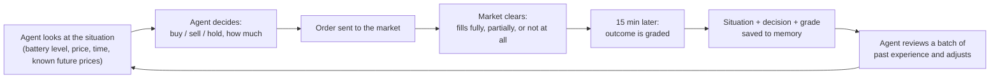
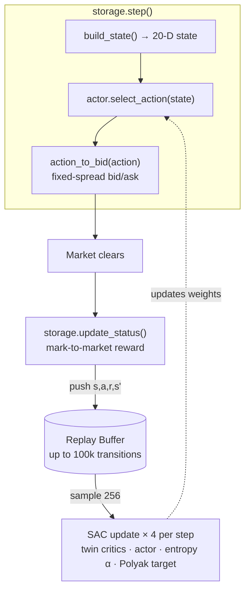

# Reinforcement Learning Storage Agent — Soft Actor-Critic (SAC)

> **Branch:** `algo/soft-actor-critic`. Each `algo/*` branch implements a
> different RL algorithm for the `storage` agent (`mesa_model/agents.py`)
> while the rest of the Local Energy Community (LEC) simulation is unchanged.
> This branch uses **Soft Actor-Critic**, implemented in PyTorch in
> `mesa_model/sac.py` and `mesa_model/storage_logic.py`.

This document explains the agent twice: first in plain English for anyone who
doesn't work with machine learning day to day, then again in full technical
detail for anyone who wants the exact equations and numbers.

## Contents

- [The problem, in plain terms](#the-problem-in-plain-terms)
- [How the agent learns](#how-the-agent-learns)
- [Why this particular algorithm (SAC)](#why-this-particular-algorithm-sac)
- [What the agent is allowed to know](#what-the-agent-is-allowed-to-know)
- [How it's graded](#how-its-graded)
- [Current results](#current-results)
- [Technical Reference](#technical-reference)
- [Glossary](#glossary)

---

## Quickstart

```bash
conda activate Diss_clean
pip install torch --index-url https://download.pytorch.org/whl/cpu   # one-time: SAC dependency
python main.py
python analysis/analyze_sac.py   # learning-curve plots + summary table
```

The simulation runs 15-minute steps over the configured date range
(01.01.2023–30.03.2023 by default, ~8,500 steps). Per-day metrics — profit,
energy bought/sold, SOC range, entropy, critic loss — are appended to
`output/sac/episode_logs.jsonl` once every simulated day (96 steps).

> **Dependency note:** this branch requires **PyTorch** (the CPU build is
> sufficient), which the MC/TD branches don't. SAC also sets
> `KMP_DUPLICATE_LIB_OK=TRUE` and pins PyTorch to a single thread so its
> OpenMP runtime coexists with Gurobi/MKL on Windows.

---

## The Goal

**Maximize profit through energy arbitrage:**

```
Buy Low  →  Store  →  Sell High  →  Profit
```

The agent must learn to *buy low and sell high* — not simply discharge the
energy it started with and stop. Getting the incentives right so the agent
actually learns this, rather than a degenerate shortcut, is most of what this
document is about.

---

## The problem, in plain terms

Every 15 minutes, the local energy market clears at a price, and that price
genuinely moves — it can be cheap at 3am and expensive at 6pm, or upended
entirely by a cloudy afternoon that drops local solar output. A battery that
buys energy while it's cheap and sells it later while it's expensive can
profit from that movement. A battery that ignores price and just charges or
discharges at a fixed rate cannot.

The hard part isn't the concept — it's that:

- **The right move now depends on what happens later**, which is unknown.
  Charging at 2pm is only correct if the evening peak actually arrives.
- **A shortcut that looks profitable in the short term can be wrong overall.**
  A battery that starts half-full and simply sells off that starting charge
  will show a string of "profitable" trades — until it's empty and has
  nothing left to sell during the *next* price spike. Early iterations of
  this project's RL agents fell into exactly this trap (see
  [Technical Reference](#a-short-history-mc--td--sac)).
- **Trading isn't free.** Grid purchases carry real fees and levies on top of
  the market price (see [How it's graded](#how-its-graded)), so idle churning
  back and forth loses money even if the price barely moves.

No fixed formula handles this well across a whole year of different price
patterns. Instead, the agent *learns* a strategy by trial and error — trying
actions, observing what they were actually worth, and gradually favoring the
ones that pay off.

---

## How the agent learns

The learning method is called **reinforcement learning (RL)**: instead of
being told the correct action for each situation, the agent tries actions and
is graded afterward on the outcome. Over many thousands of these
try-then-grade rounds, it gradually shifts its behavior toward whatever
tends to score well.

A useful mental model: imagine hiring a trainee energy trader who has never
seen this market before. Every 15 minutes you hand them a dashboard — how
full is the battery, what's the price doing, what time of day is it — and
they make one call: buy some, sell some, or do nothing. A little while later
you tell them exactly how that call affected total wealth. They write it
down, and once in a while they sit down with a stack of past rounds —
including their mistakes — and adjust how they read the dashboard next time.

Concretely, at 6pm on a January evening with the battery 55% full and prices
climbing:

1. **The agent looks at the situation** — battery level, current price, how
   the price has moved over the last few hours, what time it is, and what's
   already publicly known about the next few hours of prices.
2. **It decides**: hold, buy a bit, or sell a bit — and how much.
3. **The decision becomes a market order** — an offer to buy or sell energy
   at a given price, submitted like any other participant's.
4. **The market clears.** The order fills fully, partially, or not at all,
   depending on what everyone else offered.
5. **15 minutes later**, the agent finds out what actually happened — how
   much filled, and what that decision did to its total wealth (cash plus
   the value of energy still in the battery) — and stores that experience.
6. **Periodically, it reviews a batch of past experiences** — not just the
   most recent one — and nudges its decision-making slightly toward whatever
   tended to work.



In code, step 1–3 happen in `storage.step()` and step 4–6 happen one tick
later in `storage.update_status()`, once the market's clearing result is
known.

---

## Why this particular algorithm (SAC)

There are many ways to do trial-and-error learning. This project uses
**Soft Actor-Critic (SAC)** specifically because of three properties that
matter for a market with rare, high-value moments (price spikes and
troughs):

- **It remembers instead of forgetting.** Every experience — not just
  today's — is kept in a large memory ("replay buffer") and can be reviewed
  many times. A rare, extremely profitable price spike isn't seen once and
  discarded; it keeps informing decisions long after it happened.
- **It keeps two independent, skeptical assessors.** Two separate internal
  "critics" independently estimate how good an action turned out to be, and
  the agent always trusts whichever one is *more* pessimistic. This stops
  the agent from fooling itself into overrating a lucky-looking trade.
- **It stays deliberately curious.** Rather than snapping to a single fixed
  habit early on, the agent is rewarded for keeping some variety in its
  decisions, with *how much* variety tuned automatically over time rather
  than hand-scheduled. This keeps it from settling into a lazy, degenerate
  strategy (like "always hold") before it's actually found a good one.

---

## What the agent is allowed to know

Before every decision, the agent is shown a snapshot of the situation — 20
numbers in total. Grouped by what they tell it:

- **Where the battery stands** — how full it is right now, and how much
  headroom is left before it hits the safety limits on either side.
- **Is now a good time, price-wise** — is the current price above or below
  its recent average, where does it rank against the last 24 hours of
  prices, and — the single most useful signal — is it cheap or expensive
  *for this specific hour of the day* compared to how that hour usually
  looks (so the agent can recognize a predictable evening peak coming, not
  just react to it).
- **Which way the price is moving** — has it risen or fallen over the last
  hour and the last four hours, and how volatile has it been lately (is
  arbitrage even worth attempting right now).
- **Whether trading is worth the transaction cost** — the round-trip buy/sell
  spread relative to how much the price is actually moving.
- **What time it is** — hour of day, day of week, and month of year, so the
  agent can learn recurring patterns (e.g. weekday evening peaks).
- **What's already publicly known about the next few hours** — real
  day-ahead electricity markets publish prices 12–36 hours in advance, so
  the next ~6 hours of prices are genuinely already known, not predicted.
  The agent is allowed to see this because it's public information, not
  because it can see into the future.

Everything backward-looking is built only from prices the agent has actually
observed, and everything forward-looking is only what's genuinely already
published — there's no information leak from the true, unknowable future.

The full 20-feature table with exact formulas is in the
[Technical Reference](#state-vector-20-d).

---

## How it's graded

This is the single most important design decision in the whole agent, because
getting it wrong quietly teaches the wrong lesson.

**The naive approach fails.** If you grade the agent purely on cash in hand
each step (`money from selling − money spent buying`), then every purchase
looks like an instant loss and every sale looks like an instant gain — even
if the purchase was smart and the sale was premature. Graded this way, the
"best" strategy is to sell off whatever charge the battery started with and
then stop trading. That scores well under the naive grading scheme and is
obviously the wrong behavior. Early iterations of this project's agents
actually fell into this exact trap.

**The fix: grade on total wealth, not just cash.** Total wealth is cash *plus*
what the energy still sitting in the battery is currently worth if sold. A
purchase at a fair price barely changes total wealth (cash goes down,
stored value goes up by about the same amount) — so buying stops being
punished. Holding a full battery while the price climbs *increases* total
wealth even before anything is sold — so the agent is rewarded for correctly
anticipating a peak, not just for cashing in on one.

|  Situation | Effect on the grade | Why that's correct |
|---|---|---|
| Buy energy at a fair price | ≈ no change | Buying itself is not punished |
| Hold a full battery while price rises | Positive | Rewarded for being positioned for the peak, before selling |
| Sell at a high price | Positive (already partly credited while holding) | No double-counting of the same gain |
| Sell at a low price, or trade back and forth pointlessly | Slightly negative | Discourages pointless churn |

**A regulatory nuance worth being explicit about:** most market participants
pay real grid fees and levies on top of the market price when buying from the
grid (currently ≈11 ct/kWh gridfee + 4.7 ct/kWh levies, per `config.yaml`) —
without those, round-trip arbitrage would look far more profitable than it
really is. This simulation models the storage battery as **fee-exempt** on
those charges, reflecting a real German regulatory exemption for storage
assets (§118 EnWG). The battery's buy orders are still priced high enough to
*clear* against that fee term in the market's clearing optimizer — otherwise
night-time grid charging could never win against the fee-paying competition —
but that's purely a mechanism to get the order filled; the battery itself
never actually pays the fee, and always settles at the same uniform market
price everyone else does.

The exact reward formula is in the
[Technical Reference](#reward--mark-to-market-wealth-change).

---

## Current results

The most recent evaluation run (frozen, deterministic policy; live LEC
market, not the fast surrogate) logged mostly profitable trading days across
the 2023 Q1 evaluation window, e.g.:

| Day | Profit (€) | Bought (kWh) | Sold (kWh) | Avg. SOC |
|---|---|---|---|---|
| 2023-03-28 | +10.19 | 291 | 280 | 66% |
| 2023-03-29 | +13.79 | 343 | 342 | 57% |
| 2023-03-30 | −1.35 | 401 | 340 | 40% |

This is one snapshot in time, not a standing guarantee — run
`python analysis/analyze_sac.py` for learning curves and
`python analysis/compare_three.py` for a head-to-head comparison against the
MC/TD baselines and the near-deterministic `optimisation` upper bound (the
project's success criterion is **>75% of the optimisation baseline's
profit**).

---

## Technical Reference

*Everything below is the same information, stated precisely — architectures,
equations, and exact hyperparameters. It matches `mesa_model/sac.py`,
`mesa_model/storage_logic.py`, and `mesa_model/agents.py` as of this
document's last update.*

### Architecture overview

SAC is an **off-policy, maximum-entropy actor-critic**. Acting happens in
`storage.step()`; learning happens in `storage.update_status()` on the
following tick, once the market's clearing result for the prior step is
known (4 gradient updates per environment step — see
[Update-to-data ratio](#update-to-data-ratio-utd)).



### Networks

**Actor — squashed Gaussian policy (`GaussianActor`)**

```
state(20) → Linear(20→64) → LayerNorm → ReLU
          → Linear(64→64) → LayerNorm → ReLU
          → Linear(64→2)   →  (μ, log σ)

u      = μ + σ · ε ,   ε ~ N(0, 1)        # reparameterised sample
action = tanh(u) ∈ (−1, +1)               # +1 = max charge, −1 = max discharge
log π  = log N(u; μ, σ) − Σ log(1 − tanh(u)² + 1e-6)   # tanh correction
```

The reparameterisation trick makes the entropy term differentiable. At
evaluation (`SAC_EVAL=1`), the deterministic mean `tanh(μ)` is used instead
of a sampled action.

**Twin critics — Q(s, a) (`Critic`)**

Two independent networks `(state ⊕ action) ∈ ℝ²¹ → 64 → ReLU → 64 → ReLU → 1`,
each with a slow-moving **target** copy. The bootstrap target takes the
**minimum** of the two target critics to curb value overestimation:

```
a′, log π′ = actor(s′)
y = r + γ · ( min(Q1_target(s′, a′), Q2_target(s′, a′)) − α · log π′ )
```

### State vector (20-D)

Built by `storage_logic.state_features`, called from `storage.build_state()`.
All backward-looking features use only the rolling buffers of *observed*
prices populated in `update_status()`; the four forward-looking features use
the next known day-ahead prices — no leakage in either direction.

| Idx | Feature | Formula / description |
|---|---|---|
| 0 | `soc` | Battery charge level [0, 1] |
| 1 | `headroom_ceiling` | `(soc_ceiling − soc) / (ceiling − floor)` |
| 2 | `headroom_floor` | `(soc − soc_floor) / (ceiling − floor)` |
| 3 | `price_norm` | `(price − mean₂₄ₕ) / std₂₄ₕ` |
| 4 | `percentile` | Fraction of the last 96 observed prices below the current one |
| 5 | `price_vs_base` | `(price − hourly_EWMA[hour]) / std₂₄ₕ` — cheap/expensive *for this hour* |
| 6 | `mom_1h` | `(price − price₁ₕ_ago) / std₂₄ₕ` |
| 7 | `mom_4h` | `(price − price₄ₕ_ago) / std₂₄ₕ` |
| 8 | `vol` | `std₂₄ₕ / |mean₂₄ₕ|`, clipped [0, 5] |
| 9 | `spread_norm` | `(margin_buy + margin_sell) / std₂₄ₕ`, clipped [0, 5] |
| 10–11 | `sin/cos_hour` | Time of day (cyclic) |
| 12–13 | `sin/cos_dow` | Day of week (cyclic) |
| 14–15 | `sin/cos_month` | Season (cyclic) |
| 16 | `fwd_1h` | `(mean of next 4 known DA prices − price) / std₂₄ₕ` |
| 17 | `fwd_6h_mean` | `(mean of next 24 known DA prices − price) / std₂₄ₕ` |
| 18 | `fwd_6h_min` | `(min of next 24 known DA prices − price) / std₂₄ₕ` |
| 19 | `fwd_6h_max` | `(max of next 24 known DA prices − price) / std₂₄ₕ` |

All price-difference features are normalised by the rolling standard
deviation rather than expressed as ratios, since the underlying price series
contains many negative and near-zero points where ratios blow up or flip
sign. Features 16–19 look 24 steps (6 h) ahead (`FORECAST_STEPS = 24`),
reading day-ahead prices that are genuinely already public.

### Action → market bid/ask

`storage.action_to_bid(action)`, called after `select_action`:

```python
if action > ACTION_DEADBAND:        # charge   (ACTION_DEADBAND = 0.05)
    power     = action × max_charge
    bid_price = price_now + margin_buy + fee_ext + 0.01
elif action < -ACTION_DEADBAND:     # discharge
    power     = |action| × max_discharge
    ask_price = max(price_now − margin_sell − 0.01, ASK_PRICE_FLOOR)
    # order withheld entirely if ask_price < ASK_PRICE_FLOOR (= 0.01)
else:
    # |action| ≤ 0.05: deliberate hold, no order placed
```

`fee_ext = gridfee_ext + levies_ext` (≈ 11 + 4.7 ct/kWh from `config.yaml`).
The bid must cross this term because it appears in the market's welfare
objective for external grid purchases — without crossing it, the optimizer
would never prefer to fill an external buy, and night-time grid charging
could not clear. Storage remains fee-exempt in the actual settlement (see
[reward](#reward--mark-to-market-wealth-change)); crossing the fee here is
purely a clearing device. Filled volumes are always read back from the
market's clearing result, so the reward uses *actually traded* energy, never
the requested amount.

**Safety overrides** (checked before the deadband logic, and excluded from
the deadband but *not* from replay):

```python
if soc < 0.10:  action = +1.0, bid_price = 1000.0        # emergency charge
if soc > 0.95:  action = -1.0, ask_price = ASK_PRICE_FLOOR # emergency discharge
```

The soft operating band (`soc_floor = 0.20`, `soc_ceiling = 0.85`) is **not**
hard-enforced — the policy learns to respect it because leaving it forfeits
future profit (via the annealed shaping term, below). The 0.10/0.95 limits
are physical safety only. Override transitions are still pushed to replay:
the actor is never trained *toward* the forced action (it resamples its own
action for the loss), but the critic learns that reaching the floor triggers
a costly forced recharge — the exact signal that teaches low SOC is bad.

### Reward — mark-to-market wealth change

`storage_logic.mark_to_market_reward`, called from `storage.compute_reward()`
in `storage.update_status()`.

```python
cashflow  = (sold · p_sell − bought · p_buy) / 100                # €, at settled prices
phi(p, soc) = soc · capacity · efficiency · max(p − margin_sell, 0) / 100  # € liquidation value
reward    = cashflow + gamma · phi(p_now, soc_new) − phi(p_decision, soc_old)
```

- `p_buy` / `p_sell` — the *settled* uniform market-clearing price (falls
  back to `price ± margin` if unavailable, matching the surrogate model)
- `phi` — the liquidation value of the stored energy: what it would realise
  if sold right now, at the sell-side price, after round-trip efficiency —
  **not** the mid price, which was found to over-reward hoarding by the
  efficiency loss plus sell margin
- The `γ·phi(s′) − phi(s)` term is **potential-based reward shaping**
  (Ng et al., 1999): it densifies the learning signal around every trade
  without changing the optimal policy, because it telescopes to zero over a
  full episode
- Storage is fee-exempt (§118 EnWG), so no gridfee/levies terms appear here

**Hard-limit penalty:** `−0.5` if `soc_new < 0.05` or `soc_new > 0.97`
(physical limits only).

**Annealed soft-band shaping:** an additional pull toward
`[soc_floor, soc_ceiling]` that **decays linearly to zero** over
`shaping_anneal = 100,000` environment steps:

```python
progress = min(total_env_steps / shaping_anneal, 1.0)
w = shaping_weight * (1.0 - progress)          # shaping_weight = 1.0
if soc_new < soc_floor:   reward -= w * (soc_floor - soc_new)
if soc_new > soc_ceiling: reward -= w * (soc_new - soc_ceiling)
```

This guides the policy out of the drain/hoard corners early in training
without permanently biasing the final policy — by the time shaping reaches
zero, only the potential-based inventory term remains.

The reward is returned in raw € and scaled by `reward_scale = 10.0` before
being used in any SAC update, so the tiny per-step € amounts aren't swamped
by the O(1) entropy term.

### SAC update (`SACLearner.update`, run 4× per environment step)

```python
# 1. Critic: regress both Q-nets onto the min-target Bellman backup
y           = r·reward_scale + γ · (min(Q1ᵗ(s′,a′), Q2ᵗ(s′,a′)) − α · log π(a′|s′))
critic_loss = MSE(Q1(s,a), y) + MSE(Q2(s,a), y)

# 2. Actor (every 2nd update): maximise Q while staying stochastic
actor_loss = E[ α · log π(a|s) − min(Q1(s,a), Q2(s,a)) ]      # a reparameterised

# 3. Temperature α (every 2nd update): drive entropy toward the target, then floor it
alpha_loss = −E[ α · (log π(a|s) + target_entropy) ]          # target_entropy = −1
log_alpha  = max(log_alpha, log(alpha_min))                   # alpha_min = 0.05

# 4. Polyak update of the target critics
θ_target ← (1 − τ) · θ_target + τ · θ
```

| Symbol | Meaning |
|---|---|
| `γ` | Discount factor |
| `α` | Entropy temperature — auto-tuned so policy entropy ≈ `target_entropy` |
| `log π(a\|s)` | Log-probability of the action under the current policy |
| `Q1, Q2` | The twin critics; `Q1ᵗ, Q2ᵗ` their slow target copies |
| `τ` | Polyak averaging coefficient for target updates |
| `min(Q1,Q2)` | Clipped double-Q — curbs value overestimation |

The `alpha_min` floor was added after diagnosing that auto-tuned α could
decay toward zero prematurely on this data budget, collapsing exploration
before the policy had converged.

### Update-to-data ratio (UTD)

The Gurobi market solve (~2.25 s/step) dominates wall-clock time, so SAC's
small networks are nearly free to update by comparison. The agent therefore
runs **4 gradient updates per environment step**
(`updates_per_step = 4`), extracting roughly 4× the learning from the same
amount of simulated experience — the single most effective knob for sample
efficiency here.

### Warm-up

The first **500** steps use a uniform-random policy purely to seed the
replay buffer with a diverse initial batch, before any gradient update runs.

### Hyperparameters

| Parameter | Value | Note |
|---|---|---|
| `state_dim` | 20 | |
| hidden width | 64 | actor + critics |
| `gamma` | 0.996 | half-life ≈ 1.8 days — cross-day arbitrage stays visible |
| `tau` | 0.005 | Polyak target-update coefficient |
| `actor_lr` / `critic_lr` / `alpha_lr` | 3e-4 | Adam |
| `target_entropy` | −1.0 | for a scalar action |
| `alpha_min` | 0.05 | floor on entropy temperature |
| `buffer_size` | 100,000 | replay capacity |
| `batch_size` | 256 | per gradient update |
| `warmup_steps` | 500 | random-policy steps before any learning |
| `updates_per_step` | 4 | UTD ratio |
| `actor_update_every` | 2 | actor + α updated every other gradient step |
| `reward_scale` | 10.0 | scales the per-step € reward |
| `soc_floor` / `soc_ceiling` | 0.20 / 0.85 | soft band, policy-enforced via shaping |
| `soc_shaping_weight` | 1.0 | initial shaping strength |
| `soc_shaping_anneal` | 100,000 steps | shaping decays to 0 over this many steps |
| `ACTION_DEADBAND` | 0.05 | `\|action\|` below this places no order |

**Multi-epoch training (`main.py`):** the `SAC_EPOCHS` env var (default 1)
replays the calendar window N times, carrying the learner (networks, buffer,
step counters) across epochs. Warm-up runs once; the episode log is
auto-archived at the start of a multi-epoch run, and each record gains an
`epoch` field.

### A short history: MC → TD → SAC

Three algorithms were implemented on separate `algo/*` branches, each fixing
problems found in the last:

| Dimension | Monte Carlo (MC) | TD Actor-Critic | SAC (this branch) |
|---|---|---|---|
| Reward | raw cash-flow → drained the battery | + hand-tuned arbitrage bonus & SOC penalty | mark-to-market wealth change (fixes the bias at its source) |
| Sample use | 12 h episode, then discarded | 48 steps, then discarded | 100k replay buffer, reused indefinitely |
| Horizon (`γ`) | — | 0.98 → ~12.5 h | 0.996 → cross-day |
| Network | ~8 neurons | ~8 neurons | 64×64, twin critics |
| Exploration | — | ε-decay + "restore best weights" | auto-tuned entropy α |
| Price signal | lag proxies | lag proxies | causal hourly EWMA + momentum + volatility + known day-ahead prices |

---

## Glossary

| Term | Plain-English meaning |
|---|---|
| **State** | The snapshot of information the agent sees before deciding (battery level, price, time, etc.) |
| **Action** | What the agent decides to do — here, a single number for how much to buy, sell, or hold |
| **Reward** | The score the agent receives after a decision, telling it how good that decision turned out to be |
| **Policy** | The agent's current strategy — a mapping from state to action, which improves over training |
| **Episode** | One block of experience (here, one simulated day of steps) used for periodic logging/reporting |
| **Replay buffer** | The agent's memory of past experiences, reused repeatedly during learning |
| **Off-policy** | Able to learn from old experience, not just the most recent decision |
| **Entropy / exploration** | How much randomness the agent keeps in its decisions on purpose, so it keeps trying alternatives instead of settling too early |
| **Discount factor (γ)** | How much the agent weighs future consequences vs. immediate ones — higher means it plans further ahead |
| **Critic / Q-value** | The agent's internal estimate of how good a given action is in a given state |
| **Actor** | The part of the agent that actually picks actions (as opposed to the critic, which grades them) |
| **Target network / Polyak averaging** | A slowly-updated copy of the critic used to keep training stable |
| **Warm-up** | An initial period of random actions used only to seed the memory before learning begins |
| **Mark-to-market** | Valuing something (here, stored energy) at what it would be worth if sold right now, not just realised cash |
| **Potential-based shaping** | A reward-densifying technique that gives more frequent feedback without changing what the optimal strategy actually is |
